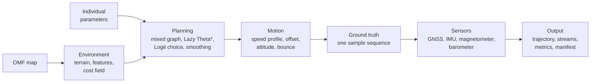

# Ourealis

Ourealis simulates human running trajectories and the sensor streams derived from
them, on static maps. Given a map, a start point and a goal, it produces a
trajectory that is kinematically feasible and statistically plausible, together
with physically consistent GNSS, accelerometer, gyroscope, magnetometer and
barometer recordings of the same run.

The output is ground truth for testing downstream algorithms: pedestrian dead
reckoning, activity classification, route-choice modelling, and any other method
that needs data whose errors, cadence and motion are known exactly.

[中文文档](README.zh.md) · [Documentation index](docs/en/index.md) · [Glossary](docs/en/glossary.md)

## Capabilities

* **Route choice that behaves like a population.** Every leg is planned as a set
  of candidate routes and chosen by a Logit draw, so two individuals with the same
  origin and destination can take different ways, and the frequency of each choice
  is a model parameter rather than a seed artefact.
* **A map format that stores no preferences.** OMF carries objective environment
  descriptions — surface type, traffic attributes, direction constraints, terrain,
  precomputed caches — and never a synthesised cost, so one map serves every
  motion mode and every individual.
* **Physiology in the speed limit.** Grade costs follow Minetti's energy model,
  cornering follows a lateral-acceleration budget, descents are capped by braking
  limits, and distance is capped by a critical-speed fatigue model.
* **Sensors that agree with each other.** Every stream is derived from one ground
  truth that carries attitude, effective curvature and a vertical bounce, so
  integrating the accelerometer recovers the barometric altitude and the
  gyroscope's yaw rate matches the trajectory's curvature.
* **Reproducibility by construction.** All randomness is keyed by
  `(seed, purpose, individual, channel)`; a run replays exactly, in parallel or
  serial, on CPU or GPU. Region-triggered sensor events can run in a
  spatially deterministic mode for regression testing and calibration.
* **Optional GPU acceleration.** Cost-field synthesis, batched noise and batched
  constraint queries run on wgpu when an adapter is present, against a CPU
  reference that is always available.

## Workspace

| Crate | Contents |
|---|---|
| `ourealis-map-format` | OMF: the static map container. Reader, writer, builder, codecs, fingerprints, patches. |
| `ourealis-core` | The simulator: environment, planning, motion, sensors, evaluation, compute backends. |
| `ourealis` | The service: configuration, job queue, and the gRPC, HTTP, WebSocket and SSE facades over the simulator, with the web interface embedded in the binary. |

Dependencies point one way: `ourealis-core` reads maps through
`ourealis-map-format`, never the reverse. Map tooling can be built against the
format crate alone. The service is the only crate that knows about the network,
and it adds no dependency to the other two.

The front-end lives in `web/` — Vite, Vue, TypeScript, tdesign, BabylonJS — and is
compiled into the service binary by its build script.

## Quick start

```bash
cargo run -p ourealis-map-format --example build_synthetic_map
cargo run -p ourealis-core --example campus_run --release
cargo run -p ourealis-core --example population --release
```

A complete run in code:

```rust
use glam::DVec2;
use ourealis_core::person::{PersonParams, Preset};
use ourealis_core::plan::StandardRequest;
use ourealis_core::sim::{MapSource, Simulator};

let output = Simulator::builder()
    .map(MapSource::omf("campus.omf"))          // or ::synthetic(spec) / ::bytes(image)
    .person(PersonParams::preset(Preset::Moderate))
    .standard(StandardRequest::new(
        DVec2::new(10.0, 10.0),
        DVec2::new(300.0, 200.0),
    ))
    .seed(42)
    .build()?
    .run()?;

println!("{:.1} s, {} GNSS fixes", output.duration_s(), output.sensors.gnss.len());
```

## Pipeline



1. **Environment.** The map's objective features are synthesised into a cost
   field, together with terrain, hard constraints and the distance transform.
2. **Planning.** A mixed graph over fine grid cells, roadmap waypoints, coarse
   blocks and Z-axis links is searched with Lazy Theta\*, the candidates are
   chosen between by a Logit model with a path-size correction, and the result is
   relaxed by an elastic band and validated against exact cell traversal.
3. **Motion.** Speed limits from physiology, curvature, downhill braking and
   fatigue are combined with a forward–backward sweep; a lateral offset,
   attitude, vertical bounce and the low-speed maneuvers finish the trajectory.
4. **Sensing.** Each sensor is derived from the same ground truth with its own
   error model, so the streams are mutually consistent by construction.

## Design rules

These invariants hold across the whole system and are enforced in code:

* **Hard constraints are boolean.** Prohibited ground is $+\infty$ in the cost
  field and is excluded in the search, in the smoother's line-of-sight check and
  in the lateral-offset feasibility check. No weighted sum can dilute it.
* **Effective curvature everywhere.** Once the lateral offset is applied, every
  consumer of curvature — roll, gyroscope, turn-rate metrics — uses
  $\kappa_{\text{eff}} = \kappa / (1 - d\kappa)$, never the centre line.
* **One phase reference.** The vertical bounce and the accelerometer's step
  harmonic share amplitude and phase, so a height estimator that integrates
  acceleration recovers the barometric altitude.
* **Bounded local dynamics.** The lateral offset is band-limited at the
  trajectory's own sample rate, and its second difference is capped by the
  individual's lateral acceleration budget, so no sensor reports a force the
  runner could not produce.
* **Event reproducibility.** Sensor events triggered by regions use a spatial
  hash, so the same individual reproduces the same event sequence.
* **Deterministic parallelism.** Batch runs are identical on one thread and on
  the whole pool, because streams are keyed by the individual index.

## Compute backends

Cost-field synthesis, batched noise generation and batched constraint queries
have a wgpu implementation and a rayon implementation. The CPU backend is the
semantic reference and is always available; `Backend::Auto` uses the GPU when an
adapter is present and otherwise falls back with a warning. The graph search
itself stays on the CPU: node expansion is branch-bound and gains nothing from a
device. `tests/gpu_cpu.rs` compares the two backends and skips itself when no
adapter exists.

## Service and web interface

```bash
# One-time front-end install, then Cargo builds everything else.
pnpm --dir web install --frozen-lockfile
cargo build --release -p ourealis          # build.rs runs the Vite build and embeds web/dist

./target/release/ourealis                   # reads config.toml next to the binary
./target/release/ourealis --config dev.toml --print-config
./target/release/ourealis --log debug
```

The service reads one TOML file and enables three facades independently:

| Facade | Switch | Carries |
|---|---|---|
| RPC | `server.rpc_enabled` | gRPC, package `ourealis.api.v1` |
| HTTP | `server.http_enabled` | REST under `/api/v1`, plus WebSocket and SSE |
| Web | `server.web_enabled` | the embedded single-page application (requires HTTP) |

Every HTTP API route lives under `/api/v1`; the page is served at `/`. Both
facades listen on loopback by default, so a default configuration is not reachable
from the network. Point a browser at the HTTP address and the interface is there —
no separate front-end deployment, and the page cannot drift from the API it calls
because the two ship in one binary.

### The workspace

`/run` is the whole interface for producing a run. It is one page with a stage rail,
the map, and the controls of whichever stage is open:

| Stage | What it decides |
|---|---|
| Map | which map to plan against |
| Route | the mode and the points, drawn by clicking and dragging on the map |
| Runner | the preset, the seed and — in expert mode — every individual parameter |
| Sensors | the sample rates and, in expert mode, the noise and event switches |
| Run | the name, the metrics switch, and the button that submits |

A route is drawn rather than typed: click the ground to place the start and the goal,
drag a handle to move it, double-click it to remove it. Planning is automatic — as soon
as the route is complete a preview runs, and the summary (length, path ratio, estimated
time) and the candidate table update as the route changes. The planner's own choice is
marked in the table; the run takes that one, because path choice is a property of the
route and the seed rather than of a row in a list.

Every long operation is a **task**: the submission returns a ticket and the result
arrives under it, so no request is ever held open for the minutes a plan or a map build
can take. Tasks the interface waits on are shown behind a modal loader with their
elapsed time and a cancel button; the rest are reported in the header's task tray. The
API surface is `/api/v1/tasks` (`POST` to submit, `GET /tasks/{id}` to poll,
`/result` for the payload, `DELETE` to cancel, `/events` for SSE).

Two levels of detail: **Simple** shows the decisions that change the result, and
**Expert** shows everything, grouped. A badge beside each group reports how many fields
differ from the recipe or the defaults. Four recipes — campus jog, track intervals,
phone and watch, clean truth — fill the whole configuration in one click.

Development runs the front-end with hot reload and proxies the API:

```bash
pnpm --dir web dev                          # http://localhost:5173, /api proxied to :8080
cargo run -p ourealis -- --config web/tests/fixtures/service.toml
```

Front-end checks: `pnpm --dir web run typecheck`, `run lint`, `run format:check`,
`run build`, `run test:unit`, `run test:e2e`, `run test:fuzz`, `run test:monkey`.

Environment variables: `OUREALIS_CONFIG` (configuration path), `OUREALIS_SKIP_WEB=1`
(skip the front-end build), `OUREALIS_REQUIRE_WEB=1` (fail instead of embedding a
placeholder page), `OUREALIS_PNPM` (pnpm executable), `RUST_LOG`.

## Testing

```bash
cargo test  --workspace --all-features
cargo clippy --workspace --all-targets --all-features -- -D warnings
cargo fmt --all --check
cargo doc   --workspace --no-deps
```

The suite is layered, and each layer answers a different question:

| Suite | Question it answers |
|---|---|
| `math_terrain`, `motion`, `sensors`, `field_search` | Do the algorithms match closed-form references? |
| `simulator` | Does a whole run hold its invariants, replay exactly and export correctly? |
| `coarse` | Do coarse blocks stay feasible, and do they replace the fine grid they cover? |
| `library` | Do stored candidate libraries obey the last-mile attach contract? |
| `connector_lift` | Do Z-axis links reach the height, the barometer and the pitch? |
| `realism` | Does one route run by one individual stay inside human physiology bands? |
| `randomized` | Do those bands hold for randomly drawn individuals and routes? |
| `real_data` | Does the simulator match public IMU recordings on the calibrated gait quantities? |
| `gpu_cpu` | Do the two compute backends agree? |
| `omf_*`, `prop_roundtrip` | Do the container layouts, codecs, graph layers, patches and fingerprints behave? |

`realism` prints its measurements under `--nocapture` and is the instrument for
tuning. `randomized` draws its case list from a fixed seed, so a failure names a
case that can be regenerated exactly. Two suites depend on external data and skip
themselves with a printed reason when it is absent: `real_data` needs records in
`data/real/`, `gpu_cpu` needs a GPU adapter.

## Real-data harness

`crates/core/tests/real_data.rs` compares the simulator against public
recordings on the quantities that have to come from measurement rather than from
a specification: step frequency, the accelerometer's second and third harmonic
ratios, and the gyroscope's step signature. Both sides are measured with the same
estimator (`ourealis_core::eval::calibrate::gait_of`), so a reported difference is
a difference between the simulator and the recordings rather than between two
measurements.

The supported collections are WISDM 2.0 (UCI 507), MotionSense, Daily and Sports
Activities (UCI 256) and HAR (UCI 240). Each contributes a different sampling
rate, device placement or pace. The recordings are not part of the repository.
Place whatever archives are available in `data/raw/` and convert them:

```bash
cargo run -p ourealis-core --example fetch_real_data
```

The tool writes one table per channel under `data/real/` — a collection carrying
both an accelerometer and a gyroscope produces two — and prints the URLs of the
archives it did not find. The test layer widens as tables appear.

`data/real/targets.toml` holds the reference values that calibration fits,
written by `cargo run -p ourealis-core --example calibrate -- --write`. The
shipped `PersonParams` presets reproduce them to within 0.05 tolerances.

## Documentation

| Document | Content |
|---|---|
| [docs/en/usage.md](docs/en/usage.md) | Building, running, the API, exports and the real-data harness. |
| [docs/en/architecture.md](docs/en/architecture.md) | Crates, module map, data flow, backends, reproducibility. |
| [docs/en/design.md](docs/en/design.md) | The algorithms: cost field, search, motion, noise, sensors, metrics. |
| [docs/en/map-format.md](docs/en/map-format.md) | OMF: byte layout, metadata, index, codecs, fingerprints, patches. |
| [docs/en/glossary.md](docs/en/glossary.md) | The vocabulary this project defines and uses. |
| [docs/en/testing.md](docs/en/testing.md) | The test layers and what each one pins down. |

The same set is available in Chinese under [`docs/zh-cn/`](docs/zh-cn/index.md).
API documentation is generated from the source: `cargo doc --workspace --no-deps
--open`.

## License
[Apache-2.0](LICENSE)