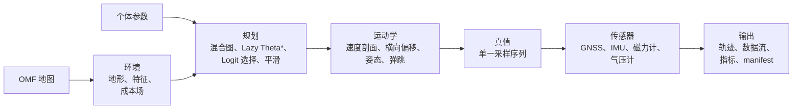

# Ourealis

Ourealis 在静态地图上模拟人类跑步轨迹，以及由这些轨迹派生出的传感器数据流。给定一张地图、一个
起点与一个终点，系统输出一条运动学可行、统计特性接近真实人类跑步的轨迹，以及同一次跑步的 GNSS、
加速度计、陀螺仪、磁力计与气压计记录。

输出是用于测试下游算法的真值数据：行人航位推算、活动识别、路径选择建模，以及任何需要"误差、
步频与运动都完全已知"的数据的方法。

[English](README.md) · [文档索引](docs/zh-cn/index.md) · [术语表](docs/zh-cn/glossary.md)

## 能力概览

* **像群体一样的路径选择。** 每一段路线都以候选集合的形式规划，再由 Logit 抽签决定，因此同一起
  终点的两个个体可以走不同的路，而每种选择的频率是模型参数而不是随机种子的产物。
* **不存储偏好的地图格式。** OMF 承载的是客观环境描述——地表类型、交通属性、方向约束、地形、
  预计算缓存——从不存储合成后的成本，因此同一张地图服务所有运动模式与所有个体。
* **把生理学写进速度上限。** 坡度代价采用 Minetti 能量模型，转弯受侧向加速度预算约束，下坡受
  制动上限约束，距离受临界速度疲劳模型约束。
* **互相自洽的传感器。** 所有数据流都由同一份真值派生，而真值携带姿态、有效曲率与垂直弹跳，
  因此对加速度计积分可以还原气压高度，陀螺仪的偏航角速度与轨迹曲率一致。
* **构造上可复现。** 一切随机量以 `(种子, 用途, 个体号, 通道号)` 为键；一次运行可以精确重放，
  并行与串行一致，CPU 与 GPU 一致。由区域触发的传感器事件可以运行在空间确定性模式下，供回归
  测试与参数标定使用。
* **可选的 GPU 加速。** 成本场合成、批量噪声与批量约束查询在存在适配器时使用 wgpu，并以始终
  可用的 CPU 实现作为对照基准。

## 工作区

| Crate | 内容 |
|---|---|
| `ourealis-map-format` | OMF 静态地图容器：读取器、写入器、构建器、编码器、指纹、补丁。 |
| `ourealis-core` | 模拟器：环境、规划、运动学、传感器、评价、计算后端。 |
| `ourealis` | 服务层：配置、作业队列，以及在模拟器之上暴露的 gRPC / HTTP / WebSocket / SSE 门面；Web 界面内嵌在二进制中。 |

依赖单向：`ourealis-core` 通过 `ourealis-map-format` 读地图，反向不存在依赖。地图工具可以只依赖
格式 crate 构建。`ourealis` 是唯一感知网络的 crate，且不向上游两个 crate 添加任何依赖。

前端位于 `web/`（Vite、Vue、TypeScript、tdesign、BabylonJS），由服务 crate 的构建脚本编译进二进制。

## 快速开始

```bash
cargo run -p ourealis-map-format --example build_synthetic_map
cargo run -p ourealis-core --example campus_run --release
cargo run -p ourealis-core --example population --release
```

代码中的一次完整运行：

```rust
use glam::DVec2;
use ourealis_core::person::{PersonParams, Preset};
use ourealis_core::plan::StandardRequest;
use ourealis_core::sim::{MapSource, Simulator};

let output = Simulator::builder()
    .map(MapSource::omf("campus.omf"))          // 或 ::synthetic(spec) / ::bytes(image)
    .person(PersonParams::preset(Preset::Moderate))
    .standard(StandardRequest::new(
        DVec2::new(10.0, 10.0),
        DVec2::new(300.0, 200.0),
    ))
    .seed(42)
    .build()?
    .run()?;

println!("{:.1} s, {} GNSS fixes", output.duration_s(), output.sensors.gnss.len());
```

## 流水线



1. **环境**：地图中的客观特征被合成为成本场，同时得到地形、硬约束与距离场。
2. **规划**：在由细网格、路标点、粗格块与 Z 轴连接组成的混合图上做 Lazy Theta\* 搜索，候选之间
   由带路径规模修正的 Logit 模型选择，结果经弹性带松弛并用精确格点遍历校验。
3. **运动学**：来自生理学、曲率、下坡制动与疲劳的速度上限经前向-后向扫描合成；随后加入横向
   偏移、姿态、垂直弹跳与低速机动，得到完整轨迹。
4. **传感**：每个传感器都以同一份真值加上各自的误差模型派生，因此数据流之间按构造即互相一致。

## 设计规则

以下不变量贯穿整个系统，并在代码中强制：

* **硬约束是布尔量。** 禁行区域在成本场中为 $+\infty$，并在搜索、平滑的视线检查与横向偏移的
  可行性校验中被排除，任何加权求和都无法稀释它。
* **有效曲率贯穿全链路。** 一旦施加横向偏移，所有曲率消费方——横滚、陀螺仪、转弯率指标——都
  使用 $\kappa_{\text{eff}} = \kappa / (1 - d\kappa)$，绝不使用中线曲率。
* **单一相位基准。** 垂直弹跳与加速度计的步频谐波共享幅值与相位，因此对加速度计积分的高度估计
  与气压高度一致。
* **局部动力学有界。** 横向偏移在轨迹自身采样率上做带宽限制，其二阶差分受个体侧向加速度预算
  约束，因此没有任何传感器报出跑者不可能产生的力。
* **事件可复现。** 由区域触发的传感器事件使用空间哈希，同一个体重复经过同一区域得到完全相同的事件
  序列。
* **并行不影响结果。** 批量运行在单线程与整个线程池上结果一致，因为随机流以个体号为键。

## 计算后端

成本场合成、批量噪声生成与批量约束查询各有一个 wgpu 实现与一个 rayon 实现。CPU 实现是语义参考，
始终可用；`Backend::Auto` 在存在适配器时使用 GPU，否则告警并降级。图搜索本身留在 CPU：节点扩展
存在严重分支依赖，GPU 化没有收益。`tests/gpu_cpu.rs` 比对两条路径，无适配器时自行跳过。

## 服务与 Web 界面

```bash
# 前端首次安装依赖，其余交给 Cargo。
pnpm --dir web install --frozen-lockfile
cargo build --release -p ourealis          # build.rs 执行 Vite 构建并把 web/dist 内嵌进二进制

./target/release/ourealis                   # 读取二进制同目录的 config.toml
./target/release/ourealis --config dev.toml --print-config
./target/release/ourealis --log debug
```

服务只读一个 TOML 文件，并独立启用三个门面：

| 门面 | 开关 | 承载 |
|---|---|---|
| RPC | `server.rpc_enabled` | gRPC，包名 `ourealis.api.v1` |
| HTTP | `server.http_enabled` | `/api/v1` 下的 REST，外加 WebSocket 与 SSE |
| Web | `server.web_enabled` | 内嵌的单页应用（要求 HTTP 启用） |

所有 HTTP API 路由位于 `/api/v1`；页面挂在 `/`。两个门面默认只监听回环地址，因此默认配置不会暴露到网络。
浏览器打开 HTTP 地址即可看到界面——不需要单独部署前端，也不必担心页面与它调用的 API 版本错位，
因为两者在同一次构建、同一个二进制里。

开发期用热更新跑前端，并把 API 代理到服务：

```bash
pnpm --dir web dev                          # http://localhost:5173，/api 代理到 :8080
cargo run -p ourealis -- --config web/tests/fixtures/service.toml
```

前端检查命令：`pnpm --dir web run typecheck`、`run lint`、`run format:check`、`run build`、
`run test:unit`、`run test:e2e`、`run test:fuzz`、`run test:monkey`。

环境变量：`OUREALIS_CONFIG`（配置路径）、`OUREALIS_SKIP_WEB=1`（跳过前端构建）、
`OUREALIS_REQUIRE_WEB=1`（前端构建失败时直接报错，而不是内嵌占位页）、`OUREALIS_PNPM`（pnpm 可执行文件）、`RUST_LOG`。

## 测试

```bash
cargo test  --workspace --all-features
cargo clippy --workspace --all-targets --all-features -- -D warnings
cargo fmt --all --check
cargo doc   --workspace --no-deps
```

测试分层组织，每一层回答不同的问题：

| 测试集 | 回答的问题 |
|---|---|
| `math_terrain`、`motion`、`sensors`、`field_search` | 算法是否与闭式参考解一致？ |
| `simulator` | 一次完整运行是否满足不变量、能否精确重放、导出是否正确？ |
| `coarse` | 粗格块是否内部可行，是否确实取代了它覆盖的细网格？ |
| `library` | 存量候选库是否遵守末端接入契约？ |
| `connector_lift` | Z 轴连接是否到达高度、气压计与俯仰？ |
| `realism` | 固定路线、固定个体的一次跑步是否落在人体生理区间内？ |
| `randomized` | 随机个体与随机路线是否同样落在这些区间内？ |
| `real_data` | 模拟器在与真实录音的对照量上是否一致？ |
| `gpu_cpu` | 两个计算后端是否一致？ |
| `omf_*`、`prop_roundtrip` | 容器布局、编码器、图结构层、补丁与指纹是否正确？ |

`realism` 在 `--nocapture` 下打印实测数值，是调参仪器。`randomized` 的用例表由固定种子抽出，
失败即定位到可精确重放的某个抽样。有两个测试集依赖外部数据，缺失时打印原因并跳过：`real_data`
需要 `data/real/` 下的表，`gpu_cpu` 需要 GPU 适配器。

## 真实数据对照

`crates/core/tests/real_data.rs` 用公开录音对照模拟器，比对的量是那些必须来自实测而不是来自规格
的量：步频、加速度计二次与三次谐波对基波的比值、陀螺仪的步态签名。两侧用同一个估计器
（`ourealis_core::eval::calibrate::gait_of`）测量，因此报出的差异是模拟器与录音之差，而不是两次
测量之差。

支持的数据集为 WISDM 2.0（UCI 507）、MotionSense、Daily and Sports Activities（UCI 256）与
HAR（UCI 240）；它们各自提供不同的采样率、佩戴方式或配速。录音不进入版本控制。把手上有的归档放进
`data/raw/` 后转换：

```bash
cargo run -p ourealis-core --example fetch_real_data
```

工具在 `data/real/` 下按通道各写一张表——同时含加速度计与陀螺仪的数据集会产出两张——并打印它没
找到的归档地址。对照层随表的增加而变宽。

`data/real/targets.toml` 保存标定拟合出的参考值，由
`cargo run -p ourealis-core --example calibrate -- --write` 写入。仓库自带的 `PersonParams` 预设
把它们复现到 0.05 个容差以内。

## 文档

| 文档 | 内容 |
|---|---|
| [docs/zh-cn/usage.md](docs/zh-cn/usage.md) | 构建、运行、公开 API、导出与真实数据对照工具。 |
| [docs/zh-cn/architecture.md](docs/zh-cn/architecture.md) | crate 划分、模块地图、数据流、计算后端、可复现性。 |
| [docs/zh-cn/design.md](docs/zh-cn/design.md) | 算法设计：成本场、搜索、运动学、噪声、传感器、评价指标。 |
| [docs/zh-cn/map-format.md](docs/zh-cn/map-format.md) | OMF：字节布局、元数据、空间索引、编码器、指纹、补丁。 |
| [docs/zh-cn/glossary.md](docs/zh-cn/glossary.md) | 本项目定义和使用的术语。 |
| [docs/zh-cn/testing.md](docs/zh-cn/testing.md) | 测试分层，以及每一层分别锁住什么。 |

英文版见 [`docs/en/`](docs/en/index.md)。API 文档由源码生成：
`cargo doc --workspace --no-deps --open`。

## 许可证
[Apache-2.0](LICENSE)