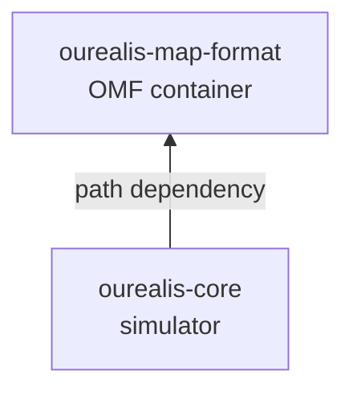
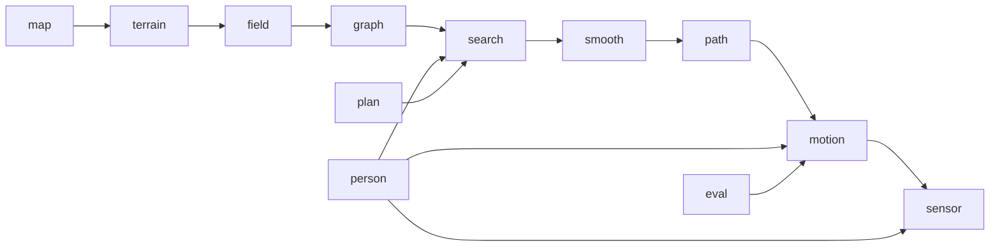

# Architecture

## Two crates, one dependency direction



`ourealis-core` reads maps through `ourealis-map-format`; the reverse dependency
does not exist. A map tool can therefore be built against the format crate without
pulling in the simulator, and no format decision can be forced by a simulation need
the format does not already express.

Inside `ourealis-core`, the pipeline is a chain of module groups, each consuming the
previous group's output and nothing else:



## `ourealis-map-format`

| Module | Responsibility |
|---|---|
| `header`, `footer`, `bytes` | The fixed 128-byte header and 64-byte footer, and the explicit little-endian read/write primitives. Every field is written at a documented offset; no packed struct is transmuted, because the header's `f64` fields are not naturally aligned. |
| `tlv` | The metadata block: tag constants, the typed payloads (`MapInfo`, `LayerTable`, `FeatureSchema`, `WeightPrior`, `SlopeModel`, `ConnectorTable`, `GlobalStats`, `AggregationRules`, …) and the reader/writer. Unknown tags survive a round trip. |
| `quadtree`, `directory` | The two-layer spatial index. The skeleton answers *at which granularity* an area is described; the directory answers *where* that description lives. |
| `codec` | The nine block codecs and their dispatch. An unknown codec identifier is reported, never fatal. |
| `raster`, `layer` | Channel-continuous chunk geometry, packing and unpacking, quantisation, and bit-packed layers. |
| `graph` | The non-raster layers: roadmap graphs, K-path libraries, vector shapes, and the fixed layout of the connector table. |
| `region` | Polygonal annotations with their event parameters and the spatial hash that makes events reproducible. |
| `fingerprint` | Source fingerprints, the derived-layer header, and the derived-algorithm version registry. |
| `builder` | The high-level write path: partitioning into mixed granularity, mean/max aggregation, global statistics, automatic derivation. |
| `writer`, `reader` | `MapWriter` (data, then directory, footer and header backfill) and `Map` (footer → header → directory, chunks on demand, LRU cache). |
| `patch` | The incremental update format and its application, including the base-hash check. |
| `synthetic` | The deterministic map generator used by the examples and the tests. |

## `ourealis-core`

| Module | Responsibility |
|---|---|
| `math` | `LocalFrame` (geographic ↔ local metre plane), sampling helpers (interpolation, moving average, angle unwrapping and low-pass filtering, percentiles, histograms), and a dependency-free radix-2 FFT with Hann windowing. |
| `terrain` | `Grid2D` geometry, the elevation field with its level-of-detail pyramid, the slope field, and the exact Euclidean distance transform with its quantised gradient. |
| `field` | The cost model. `FeatureField` views the resistance vector, `CostWeights` holds the weight vector, `HardMask` answers passability, `CostField` synthesises per-cell cost, and `CostSampler` answers cost and passability at an arbitrary point. |
| `graph` | The mixed search substrate: fine grid cells, roadmap waypoints, coarse blocks, Z-axis link endpoints and interface nodes, with the line-of-sight check that integrates cost and rejects hard constraints and link footprints. |
| `search` | Lazy Theta\* with an inflated heuristic and a turn penalty; candidate generation by edge penalisation; the path-size factor and the Logit draw. |
| `smooth` | The elastic band with hard projection, the shortcut simplifier, spike removal, and corner rounding. |
| `path` | `Path`: arc-length parameterisation, tangent, normal and curvature, and the two per-vertex link channels. |
| `motion` | Speed limits, pacing and fatigue with their fixed-point iteration, the forward–backward profile, the lateral offset with its feasibility checks, attitude, bounce, and the low-speed maneuvers. |
| `noise` | The three layers of randomness: the Ornstein–Uhlenbeck process and its exact discretisation, white noise, the step harmonics, and the region-event scheduler. |
| `sensor` | Truth assembly and the five sensor models derived from it. |
| `person` | `PersonParams` and the population sampler. |
| `plan` | The three planning modes, the library attach contract, and the clearance ladder that guarantees a feasible route leaves the planner. |
| `eval` | The metrics, the spectrum summaries, and the calibration harness with its coordinate search. |
| `gpu` | The `ComputeBackend` trait, a rayon reference implementation, and the wgpu implementation with its WGSL kernels. |
| `sim` | The `Simulator` facade, the batch runner, the configuration tree, the output types and the exports. |

## Data flow of one run

1. **Load.** `MapSource::open` yields a `Map`. `Simulator::weights` resolves the
   weight vector: an explicit override, or the map's weight prior for the
   configured motion mode, optionally modulated by the attention gate.
2. **Environment.** `Environment::load_with_coarse` reads the layers, derives
   whatever the map does not carry (slope by central differences, the distance
   transform from the hard mask), builds a roadmap if the map has none, and asks
   the compute backend for the weighted feature sum. The result is a `CostField`.
3. **Graph.** `MixedGraph` assembles the four node kinds over that field. Edges are
   generated lazily and cached, so a search only pays for the band it expands.
4. **Plan.** For each leg, `search::ksp::generate_candidates` produces up to $K$
   candidates, `search::logit` draws one, and `smooth::smooth_path_anchored`
   relaxes the chosen polyline with the leg joints held fixed.
   `plan::clearance::first_clear_path` then validates the result against the exact
   cell traversal and falls back through the earlier stages if it has to.
5. **Stamp.** `sim::connector_lift::lift_connector_elevations` writes the two
   per-vertex link channels onto the finished path: the elevation ramp and the
   speed ceiling of every Z-axis link the path traverses.
6. **Motion.** `Trajectory::build_with_backend` builds the speed profile, the
   lateral offset, the attitude and the bounce, then assembles the trajectory
   timeline sample by sample at the configured truth rate.
7. **Sense.** `sensor::generate` walks the truth once per sensor, each with its own
   error model and random stream.
8. **Evaluate.** `MetricsReport::compute` reads the trajectory, the sensors and the
   truth; `eval::calibrate` can turn the report into a scalar loss.

## Compute backends

```rust
pub trait ComputeBackend: Send + Sync {
    fn name(&self) -> String;
    /// C[cell][mode] = Σ_d F[cell][d]·W[d][mode] + c0
    fn cost_field_batch(&self, f: &FeatureTensor, w: &WeightMatrix, c0: f32) -> Result<CostBatch>;
    /// N individuals × T samples of Ornstein–Uhlenbeck drift plus white noise.
    fn noise_batch(&self, spec: &NoiseBatchSpec) -> Result<NoiseBatch>;
    /// Batched passability and clearance queries.
    fn projection_check_batch(&self, request: &ProjectionBatch) -> Result<ProjectionBatchOut>;
}
```

The design of the backend boundary follows from what the workloads look like:

* **The CPU backend is the semantic reference.** It is always available and is
  what the test suite exercises; the GPU is compared against it.
* **The GPU does not search.** Node expansion is branch-bound and gains nothing
  from a device, so the graph search stays on the CPU by design.
* **The noise kernel is counter-based.** A sequential generator cannot be advanced
  in the same order on a GPU, so the kernel derives each sample from
  `hash(seed, individual, channel, sample)` through Box–Muller. The Rust side
  exposes the same `counter_gaussian`, so both produce the same sequence.
* **Batched queries are opt-in.** The three kernels answer the same questions as
  their scalar counterparts, and the batched path is taken only when a caller asks
  for it. For a single trajectory the kernel launch and readback overhead exceeds
  the cost of the in-memory queries it replaces; the gain belongs to the bulk case,
  where one read-only field and one batch are shared by many individuals.
* **Failure degrades, never aborts.** A missing adapter, a failed device creation
  or a failed shader compilation falls back to the CPU with a warning. Readback
  failures are reported as errors rather than silently returning zeros.

## Reproducibility

Every stochastic quantity draws from a stream keyed by `(seed, purpose, individual,
channel)`, mixed into a ChaCha stream — never a thread-local generator. Two
properties follow, and the rest of the system depends on them:

* **A batch run is bit-identical whether it runs on one thread or on the rayon
  pool**, because a stream depends on the individual's index rather than on which
  thread picked it up. A test asserts exactly this.
* **A run can be replayed from its manifest**, which is why the manifest records
  the map, the mode, the individual's parameters, the seed, the individual index,
  the resolved backend and the sample rates.

The key fields are mixed term by term rather than packed into bit fields, so no two
logically independent processes can share a stream. Region events additionally have
a spatially deterministic trigger mode, in which the decision and the bias direction
come from a hash rather than a draw (§6.3 of the [design](design.md)).

## Conventions

* **Numbers.** World geometry and kinematics are `f64`. `f32` appears only at the
  OMF storage boundary and in GPU buffers, where metre-scale coordinates need no
  more precision.
* **Cost.** Two units, named apart: `*_cost_per_m` is resistance per metre of path,
  `*_equiv_m` is accumulated equivalent metres, the unit route choice and the
  search heuristic are calibrated in.
* **Errors.** Library code returns `Result`. `unwrap` and `panic!` appear only in
  tests and examples; a malformed map or an unusable start or goal produces a typed
  error rather than a crash.
* **Text.** Everything written at runtime — logs, error messages, example output —
  is English.
* **Documentation.** Every public item carries a cargo-doc comment stating units,
  sign conventions and failure conditions, and both crates enable
  `#![warn(missing_docs)]`.

## Module layout

Modules are cut by responsibility rather than by line count, and a module that
grows a second responsibility gains a submodule rather than a longer file. Tests
never live in the source tree:

* integration tests are `crates/*/tests/*.rs`;
* unit tests for private items are `crates/*/tests/unit/*.rs`, included by the
  module under test through `#[cfg(test)] #[path = "..."] mod tests;`, so private
  implementation can be tested without mixing test code into it;
* shared fixtures are `crates/*/tests/fixtures/mod.rs`.
