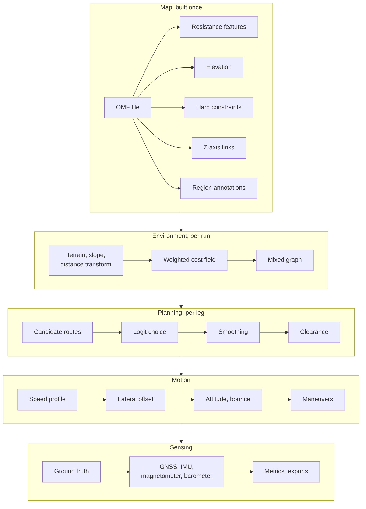
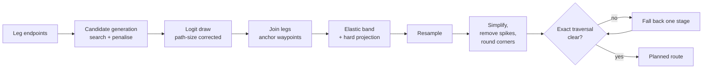

# Design

This document describes how Ourealis turns a map, a start point and a goal into a
trajectory and a set of sensor streams. It covers the model behind each stage, the
formulas the implementation evaluates, and the conventions the data follows.

The system is built as five stages:

Two separations run through the whole design and explain most of the decisions
below.

**Environment and preference are separate.** The map stores what the ground is;
the runner's weights turn that into what it *costs*. Nothing in the pipeline needs
a second map for a second motion mode.

**Search and generation are separate.** The search decides which positions the
runner passes through; the motion stage decides how fast, how the body is
oriented, and what the sensors record. Kinematic limits belong to the second stage,
which is why the search is a plain graph problem with a clean optimality story.

## 1. Coordinates and terrain

### 1.1 Local metre plane

All geometry is computed in a local tangent plane anchored at the map's reference
point $(\lambda_0, \varphi_0)$. A geographic position $(\lambda, \varphi)$ becomes

$$
x = R\,(\lambda - \lambda_0)\cos\varphi_0, \qquad y = R\,(\varphi - \varphi_0),
\qquad R = 6\,371\,000\ \mathrm{m},
$$

with longitude and latitude differences in radians, and the inverse is

$$
\lambda = \lambda_0 + \frac{x}{R\cos\varphi_0}, \qquad \varphi = \varphi_0 + \frac{y}{R}.
$$

Over a campus-sized area the plane approximation's error is far below the sensor
noise floor. `math::LocalFrame` holds the reference point and the cosine factor;
geographic output is produced by its inverse.

### 1.2 Elevation and slope

`Terrain` samples elevation bilinearly, with a level-of-detail pyramid for coarse
queries. Slope comes from central differences:

$$
\nabla h = \left(\frac{h(x+d,y) - h(x-d,y)}{2d},\ \frac{h(x,y+d) - h(x,y-d)}{2d}\right),
$$

$$
i = \lVert \nabla h \rVert, \qquad i_\parallel = \nabla h \cdot \hat{v}.
$$

$i$ is the terrain's own steepness and is never negative; $i_\parallel$ is its
component along the direction of travel $\hat{v}$, **positive uphill**. The same
quantity appears again as the *grade* of a Z-axis link, where the link's own
elevation ramp overrides the terrain underneath it (§5.1).

### 1.3 Distance transform

`terrain::edt` computes the exact Euclidean distance to the nearest forbidden cell
with the two-pass Felzenszwalb transform, in metres, together with a gradient
quantised to 16 compass directions. Two consumers use it and they need different
things from it: the elastic band wants the *direction* away from an obstacle, and
the lateral-offset check wants the *distance*. Quantising the gradient once,
during preprocessing, spares both of them from differentiating a field that is
nearly constant in the middle of an open area — a difference quotient there is
numerically ill-conditioned and its direction is noise.

## 2. Cost field

### 2.1 Resistance features

Every cell carries a $D$-dimensional **resistance feature vector**
$\mathbf{f} \in \mathbb{R}^D$ describing the environment objectively: surface type,
traffic attributes, direction constraints, crowding, and whatever further
dimensions the map declares in its feature schema. The vector says nothing about
who is running.

One dimension is special: a direction constraint is stored as a preferred
direction $\hat{d}_t$ with a strength $\alpha_t$, and its contribution depends on
the direction of travel rather than on the cell alone:

$$
f_{\text{dir}} = 1 + \alpha_t\,(1 - \cos\theta), \qquad \cos\theta = \hat{v}\cdot\hat{d}_t .
$$

Running with the constraint costs nothing extra; running against it costs
$1 + 2\alpha_t$. A preferred running direction on a track and a one-way footpath
are the same construct.

### 2.2 Synthesis

Cost per metre is synthesised at run time:

$$
c_{\text{cell}} =
\begin{cases}
+\infty, & \text{hard-forbidden cell},\\[4pt]
\max\left(\mathbf{w}^\top \mathbf{f} + c_0,\ \ c_{\text{base}} \prod_{t \in T_{\text{soft}}} w_t\right), & \text{otherwise},
\end{cases}
$$

with $c_0 = 1.0$, $c_{\text{base}} = 1.0$ and an empty soft-rule set by default.

Three properties of this expression are deliberate:

* **The linear term carries preferences.** Surface, crowding, lighting and
  direction bias are all things a runner trades against one another.
* **Rules that must not be traded go elsewhere.** Prohibited ground and required
  directions are boolean conditions enforced in the search, the smoother and the
  offset check, not large numbers in a sum. A large number can always be outvoted
  by enough cheap ground.
* **The two branches are combined with a maximum**, so a soft rule cannot be
  averaged away by a low feature sum, and a low multiplier cannot argue down a
  high feature sum. Either mechanism alone is enough to make a cell unattractive.

$+\infty$ is represented by the sentinel `INFINITE_COST` $= 10^{30}$, large enough
to dominate any real path cost and small enough that accumulating it cannot
overflow a 32-bit float to infinity. Accumulated cost above `PRUNE_THRESHOLD`
$= 10^{29}$ prunes a search node.

### 2.3 Weights

The default weight vector is the map's prior for the configured motion mode:

$$
\mathbf{w} = w_{\text{scale}} \cdot \operatorname{softmax}\!\left(\frac{\mathbf{p}_m}{\tau}\right),
$$

with $w_{\text{scale}} = 1$ (`cost_scale`) applied exactly once, in the cost field
itself.

An optional **attention gate** modulates the prior by context — time of day,
region type, individual parameters:

$$
\mathbf{q} = W_q \mathbf{z}_{\text{ctx}}, \qquad \mathbf{k}_i = W_k \mathbf{e}_i,
\qquad \alpha_i = \operatorname{softmax}_i\!\left(\frac{\mathbf{q}^\top \mathbf{k}_i}{\sqrt{d}}\right),
$$

$$
\tilde{\alpha}_i = D\,\alpha_i, \qquad
\tilde{\alpha}_i' = \operatorname{clip}(\tilde{\alpha}_i, a_{\min}, a_{\max}), \qquad
\tilde{\alpha}_i'' = D\,\frac{\tilde{\alpha}_i'}{\sum_j \tilde{\alpha}_j'},
$$

$$
w_i = w_{\text{prior},i} \cdot \tilde{\alpha}_i'' .
$$

$d$ is the width of the projected embedding and $D$ the number of resistance
channels; the two are independent and are kept in separate fields. Scaling by $D$
makes the mean gain one, clipping keeps a dimension from being suppressed entirely
or amplified without bound, and the second renormalisation restores the mean-one
property that clipping would otherwise break. The gate acts on feature *channels*,
not on a sequence, and its matrices are built from domain knowledge rather than
trained.

### 2.4 Heuristic lower bound

A search heuristic needs a lower bound on the cost of a metre of travel anywhere
on the map, but that number cannot be stored: cost is a run-time synthesis and the
map does not know the weights. It is reconstructed from the per-channel minima in
the map's global statistics:

$$
\bar{c}_{\min} = \sum_i w_i\, f_{i,\min} + c_0, \qquad
\bar{c}_{\min}^{+} = \max\left(\bar{c}_{\min},\ c_{\varepsilon}\right),
\qquad c_{\varepsilon} = 10^{-3}.
$$

The positive floor exists because a map whose feature minima are all zero would
otherwise produce a zero heuristic and reduce the search to a blind flood. When
the map carries Z-axis links, the bound is lowered to the smallest link unit cost
as well: a link is an edge like any other, and a bound that ignored it would
overestimate the remaining cost on a route over a footbridge.

### 2.5 Sampling

`CostSampler` answers two questions at an arbitrary point: is it passable, and what
does a segment cost?

Passability is decided by an **exact cell traversal** (Amanatides–Woo), not by
sampling along the segment. Any fixed sampling step can miss a cell that a segment
only clips: a shortcut cutting a building's corner has a chord shorter than the
step, with both endpoints on legal ground. The traversal visits exactly the cells
the segment enters, at a cost of one step per cell boundary crossed rather than per
metre.

Segment cost is the trapezoidal integral of the cost field along the segment, in
equivalent metres — the quantity route choice is calibrated in.

## 3. Mixed graph

### 3.1 Node kinds

The search substrate has four kinds of node in one identifier space:

| Kind | Role |
|---|---|
| Fine grid cell | Structured areas. A node *is* its cell index. |
| Roadmap waypoint | Open areas, modelling desire lines. |
| Coarse block | A certified-uniform region standing for all the fine cells inside it. |
| Z-axis link endpoint | The two ends of a stair, lift, bridge or underpass. |

Adjacency is computed the first time a node is expanded and cached thereafter.
Materialising the whole graph would cost memory proportional to the map area,
while a search only ever expands a band around the start–goal corridor.

### 3.2 Coarse blocks and mean/max aggregation

A coarse block is admitted from the map's quadtree skeleton only when the map
certifies it: a leaf, no drill hint, no direction constraint, no
suspected-infeasibility flag, and an aggregated **maximum** below the passable
threshold.

The maximum is what makes this safe. A block that stored only the mean of its
cells could contain a wall and still average out to "passable"; storing both the
mean and the maximum lets the search use the block when it is uniform and descend
to the fine cells when it is not. A block whose footprint touches a Z-axis link is
rejected outright, because a flat line across a stairwell is prohibited and a block
that hid one would let the search walk through it.

Admitted blocks replace the fine cells inside them: those cells carry no edges and
are skipped by every nearest-node query. The footprint is clipped to the map extent
first, since the skeleton's square is larger than a non-square map.

### 3.3 Roadmap and interface nodes

Open ground is sampled at `spacing_m` (15 m by default) with jitter, keeping points
whose local cost variance is below `openness_variance`; survivors are connected
within `connect_radius_m` (40 m) wherever a line of sight exists. The randomness is
deliberate — different roadmap batches imply different desire lines, and a map may
carry several with their seeds recorded so a run can pick one per individual.

Roadmap and fine grid are stitched together by **interface nodes**. An interface
node is a point on the boundary between open and structured ground that belongs to
both substrates: it is connected to the nearest roadmap waypoint and to the fine
grid cell it sits in. Along the boundary cell's side facing open ground, points are
emitted every `interface_spacing_m` (2 m), which is the granularity the fine grid is
built at; a coarser stitch would leave the two substrates joined in a handful of
places and force a detour to reach one.

### 3.4 Line of sight

`line_of_sight` is a cost-integrated check rather than a geometric one. It

1. walks the exact cells the segment enters and rejects the segment on any hard
   constraint;
2. rejects a segment that enters a Z-axis link's footprint, and rejects a link's
   own planar chord, so a route over a stair must use the link edge;
3. rejects a coarse block whose aggregated maximum exceeds the passable threshold;
4. otherwise returns the trapezoidal integral of the cost field along the segment,
   which prices the edge.

## 4. Route planning

### 4.1 Search

The search is **Lazy Theta\*** with an inflated Euclidean heuristic:

$$
h(n) = \varepsilon \cdot d_{\text{horiz}}(n, \text{goal}) \cdot \bar{c}_{\min}^{+},
\qquad
\varepsilon = \begin{cases} 1.5, & \text{single-leg request},\\ 1.2, & \text{multi-leg request}.\end{cases}
$$

Theta\* connects a node directly to its grandparent whenever a line of sight exists,
which produces any-angle paths instead of the eight-direction staircase of grid
A\*, and the lazy variant defers that test to node expansion, removing most of the
checks without losing the path quality. The runner is an omnidirectional agent —
they can turn on the spot — so no kinematic constraint is imposed at this stage.

The inflation when a request has exactly one leg reflects the cost structure of
planning: with one leg the search *is* the planning cost, and the inflation then
costs nothing in route length while expanding far fewer nodes. With several legs,
each later leg is planned against the same graph and the inflation starts to bend
the route, so multi-leg requests keep the design value $\varepsilon = 1.2$.

Each edge cost includes a **turn penalty**

$$
c_{\text{turn}} = \lambda_\theta (1 - \cos\Delta\theta), \qquad \lambda_\theta = 1.0\ \text{equivalent metre},
$$

where $\Delta\theta$ is the change of direction between consecutive segments. It
biases the search towards routes the motion stage can run smoothly — without it, a
shortcut can produce a hairpin the runner would have to stop for. It is a
preference and not a constraint, and it makes the search's cost function
non-metric, so no optimality guarantee is claimed for the returned route.

**Cost accounting.** The cost a search reports is recomputed from the geometry it
returns: every segment is integrated against the cost field, except the ones a
Z-axis link traversal spans, which are charged the link's own cost
$\ell_e \cdot c_{\text{connector}} + c_{\text{wait}}$, with $\ell_e$ the
three-dimensional length. The search's internal $g[\text{goal}]$ cannot be reported
instead: it contains turn penalties for corners that the shortcut rule later
removed, and it excludes the two attachment segments at the ends.

### 4.2 Candidates and the Logit draw

$K$ candidate routes ($K = 5$ by default) are generated by penalisation: search,
multiply the edges of the accepted route by $\mu = 1.6$, search again. A candidate
is dropped when it duplicates an earlier one, or when it shares more than 80 % of
the shorter route's length with one of them. After a configured number of penalty
steps without an acceptable candidate, the leg is declared to have fewer than $K$
distinct routes — a fact about the geometry rather than an error.

The choice between candidates is a Logit draw with a path-size correction:

$$
P(j) = \frac{PS_j \exp(-C_j/\beta)}{\sum_{k=1}^{K} PS_k \exp(-C_k/\beta)},
\qquad
PS_j = \sum_{e \in j} \frac{\ell_e}{L_j} \cdot \frac{1}{\sum_{k=1}^{K} \mathbb{I}(e \in k)} .
$$

$\beta$ is the individual's **rationality temperature** in equivalent metres: 80,
120 and 60 for the easy, steady and racing presets. $\beta \to 0$ approaches a
deterministic choice of the cheapest route; large $\beta$ approaches a uniform
draw. This is the main source of route diversity between individuals, and the
reason a population takes the paths a population would take. The path-size factor
discounts the parts a candidate shares with others, so two nearly identical
candidates do not double-count one corridor.

Two contracts keep this measurable:

* **One generator.** Stored libraries and on-line generation use the same
  candidate generation implementation with the same parameters, and the parameter
  set is hashed into the stored library's header. A mismatch is reported and the
  route is generated on line, because mixing the two sources would make the
  route-choice frequency distribution incomparable between a run that hit the
  library and one that did not.
* **Last-mile attach.** A stored candidate's endpoints are indexed by a coarse
  origin–destination key and can sit tens of metres from the query. The stored
  route is used only when both of its exact endpoints are within
  $d_{\text{attach}} = 30\ \mathrm{m}$ of the query; otherwise the whole route is
  generated on line. Inside the threshold, two attachment segments are searched in
  a local window of $2\,d_{\text{attach}}$, and the joined polyline is re-priced and
  re-measured, because the numbers stored with the body describe the body and not
  the attached route.

### 4.3 Smoothing

The chosen polyline is relaxed as an **elastic band**. For every interior vertex
$\xi_i$:

$$
\xi_i \leftarrow \xi_i + \beta_s\left(\tfrac{1}{2}(\xi_{i-1} + \xi_{i+1}) - \xi_i\right)
+ \eta\,\nabla d(\xi_i)\,\phi\!\left(d(\xi_i)\right),
$$

with $\beta_s = 0.35$, $\eta = 0.6$ and

$$
\phi(d) = \operatorname{clamp}\!\left(\frac{r_{\text{safe}} - d}{r_{\text{safe}}}, 0, 1\right),
\qquad r_{\text{safe}} = 0.75\ \mathrm{m}.
$$

The avoidance term uses the **positive** distance gradient — the direction away
from the nearest obstacle — gated so that it acts only within the safety radius. A
negative gradient would push the band *into* obstacles.

Iteration stops when the largest displacement falls below 0.02 m or after 30
iterations. After each iteration the band is projected back onto feasible ground: a
vertex inside a forbidden cell is pulled to the nearest passable cell centre, a
vertex closer than $r_{\text{safe}}$ is pushed out along the gradient, and a
segment crossing a hard constraint receives a midpoint (with an overall cap on the
point count, since a thick obstacle would otherwise double the polyline every
iteration). The projection, not the forces, is what keeps the result legal.

**Anchors.** The endpoints of a route are fixed, and so is every waypoint the
caller requested. This matters more than it looks: the contraction term drives
towards the straight chord between the endpoints, and on the polyline a search
returns — whose vertices are tens of metres apart — it will pull a waypoint's
detour out of the route entirely within the iteration budget. A waypoint is part of
what the caller asked for, exactly like the endpoints. The shortcut pass that
follows runs span by span between anchors, because it preserves the first and last
vertex of whatever it is given and would otherwise cut the corner an anchor stands
for.

**Curvature and corner rounding.** Curvature is estimated from three consecutive
samples of the resampled polyline and is deliberately not low-passed. A three-point
estimate over-estimates the curvature at the vertices of a resampled polyline, and
smoothing it raises the speed ceiling in a bend while the offset clamp still sees
the raw curvature; the two then disagree, the offset is pulled in every other
sample, and the resulting jerk is far above what a runner produces. What the window
was meant to fix belongs in the geometry, so the band rounds its corners instead:
`round_corners` replaces every vertex turning by more than about 10° with a
circular arc of radius $\min(R_{\text{corner}}, L_{\text{straight}})$, sampled so
that no inserted vertex turns by more than 5°. Every inserted point is checked for
passability, and a corner that cannot be rounded is left as it is.

**Spikes.** An out-and-back of a metre or less — the path leaves a line and returns
to it — is removed wherever a shortcut around it is traversable. The motion stage
advances arc length monotonically, so a spike makes the runner's position reverse
while their arc keeps growing, which the accelerometer reads as an impossible
force.

### 4.4 Clearance ladder

Several passes touch the geometry after the search, and each can only check its own
output against a local or sampled model of the environment. A hard constraint is
not negotiable, so the finished polyline is validated against the exact cell
traversal, and if it fails the planner unwinds the stages until one is clear. The
searched geometry is the last resort, and it is already clear, because the search
priced every one of its edges with the same traversal test. Only a failure of every
stage is reported as an error, which makes "the planner returned a route" and "the
route is traversable" the same statement.

## 5. Motion

### 5.1 Speed limits

At every profile sample the speed ceiling is the minimum of four terms:

$$
v_{\lim}(\ell) = \min\Big(\underbrace{v_{\text{slope}}(\ell)}_{\text{physiology}},\
\underbrace{\sqrt{a_{\text{lat,max}} / \lvert\kappa(\ell)\rvert}}_{\text{cornering}},\
\underbrace{v_{\text{fatigue}}(t)}_{\text{fatigue}},\
\underbrace{v_{\text{down,cap}}(\ell)}_{\text{braking}}\Big).
$$

**Slope.** The physiological cost of running follows Minetti's energy model, in
joules per kilogram per metre of *horizontal* distance:

$$
C(i) = 155.4\,i^5 - 30.4\,i^4 - 43.3\,i^3 + 46.3\,i^2 + 19.5\,i + 3.6
\qquad [\mathrm{J\,kg^{-1}\,m^{-1}}],
$$

with the **input** clamped to $\lvert i \rvert \le 0.25$: beyond that the polynomial
is not physical, and a steep descent would yield a negative cost. Clamping the input
rather than the output is what keeps a negative ceiling from ever appearing.
Holding the energy rate constant gives the speed along the path:

$$
v_{\text{slope}} = v_{\text{target}} \cdot \frac{C(0)}{C(i_{\text{ahead}})} \cdot \sqrt{1 + i_{\text{ahead}}^2},
$$

where the square root converts horizontal speed into speed along the arc; it is
close to one on gentle ground and is kept for consistency on steep ground.

$i_{\text{ahead}}$ is the grade over a look-ahead window of 15–30 m, because a
runner reacts to what is coming rather than to where they are. The default
aggregation is a distance-weighted mean; an alternative mode takes the most adverse
climb in the window when it exceeds 0.05, which models a runner who is conservative
about a visible hill.

**Cornering.** Lateral acceleration is bounded by $a_{\text{lat,max}}$, 1.5 to
3.5 m/s² depending on the preset:

$$
v \le \sqrt{\frac{a_{\text{lat,max}}}{\lvert\kappa\rvert}} .
$$

The budget is below a cyclist's, because a runner has no lateral support in the
flight phase. This is the only place where running's lateral acceleration is
constrained; the search does not impose it, which is what keeps the search a plain
graph problem.

**Fatigue.** Distance is bounded by a critical-speed model:

$$
v_{\text{fatigue}}(t) = v_{\text{crit}} + (v_0 - v_{\text{crit}})\,e^{-t/\tau_f},
\qquad v_0 = v_{\text{target}}, \quad v_{\text{crit}} = \rho\, v_{\text{target}},
$$

with $\rho$ between 0.65 and 0.85 and $\tau_f$ between 600 and 1500 s. It enters as
an upper bound: it can hold a tired runner back, it never forces a speed.

**Downhill braking.** Constant-energy running would predict a *higher* speed on a
descent, which braking, landing impact and cadence do not allow:

$$
v_{\text{down,cap}} = k_{\text{down}} \cdot v_{\text{target}} \quad \text{whenever } i_{\text{ahead}} < 0,
\qquad k_{\text{down}} \in [1.10,\ 1.20].
$$

**Z-axis links.** A link overrides all four terms with the equivalent speed its
record declares (0.5 m/s ascending and 0.7 m/s descending for stairs by default).
Steps are not a continuous slope, so the physiological model does not describe them,
and without the override a runner would take a stairwell at the speed of the ground
beside it. The link's grade likewise comes from its own elevation ramp rather than
from the terrain beneath it, so the pitch and the barometer follow the stair and the
slope limit does not fight it.

### 5.2 Pacing and the time coupling

The intended pace follows a normalised strategy

$$
g_{\text{even}}(\tau) = 1, \qquad
g_{\text{pos}}(\tau) = 1 + a\,(1 - 2\tau), \qquad
g_{\text{neg}}(\tau) = 1 + a\,(2\tau - 1),
$$

$$
v_{\text{target}}(t) = \bar{v}\, g(t/T), \qquad \bar{v} = L/T, \qquad a = 0.06,
$$

where $\tau = t/T$ is normalised time. All three have mean one over the run, so a
strategy redistributes effort without changing the average pace.

Fatigue and pacing depend on elapsed time, elapsed time depends on the speed
profile, and the profile depends on fatigue and pacing. The dependency is resolved
by a damped fixed-point iteration:

$$
T^{(0)} = \frac{L}{\bar{v}}, \qquad t^{(0)}(\ell) = T^{(0)} \frac{\ell}{L},
$$

$$
v_{\lim}^{(k)}(\ell) = f\big(\ell,\ t^{(k)}(\ell),\ T^{(k)}\big)
\;\longrightarrow\; \text{forward–backward sweep} \;\longrightarrow\; t_{\text{raw}}^{(k+1)}(\ell),
$$

$$
T^{(k+1)} = T^{(k)} + \omega\left(t_{\text{raw}}^{(k+1)}(L) - T^{(k)}\right), \qquad \omega = 0.5 .
$$

The time map is rescaled to the damped total. The iteration stops when
$\lvert \Delta T \rvert < 0.5$ s or after three iterations. If $\lvert \Delta T \rvert$
keeps growing or exceeds 60 s, the run is declared divergent: the pacing strategy
falls back to even, fatigue is evaluated once at $T^{(0)}$, and a warning is
reported. The fallback is what guarantees that a kinematically feasible profile is
always produced — a run may lose pacing fidelity, never consistency between its
clock and its speeds.

Evaluating the time-dependent terms on the *previous iteration's* time map, rather
than on an arc-length proportion, is what makes fatigue track the pace distribution
actually being produced; it is also what makes a strong positive split the hardest
case, which the damping exists to stabilise.

### 5.3 Forward–backward profile

Acceleration feasibility is imposed by two sweeps over the profile samples:

$$
\text{forward:}\quad v_{i+1} = \min\!\left(v_{\lim,i+1},\ \sqrt{v_i^2 + 2\,a_{\max}\,\Delta\ell}\right),
$$

$$
\text{backward:}\quad v_i = \min\!\left(v_{\lim,i},\ \sqrt{v_{i+1}^2 + 2\,a_{\max}\,\Delta\ell}\right).
$$

Both use a plus sign; the backward sweep is the same recurrence evaluated from the
end, and that is what makes deceleration begin early enough for the limit ahead. A
minus sign would permit speeds the runner cannot brake down to.

**Boundaries.** A normal run starts and ends at rest: $v_{\lim}(L) = 0$ at the end
is what produces the natural deceleration into the finish. A single-lap circuit uses
a periodic boundary instead, found by repeating the sweep with the average of the
first and last speeds until they agree, so the loop closes across its seam.

**Stops** — dwell waypoints, and the zero-duration stops registered at reversals —
are enforced at the single profile sample nearest their arc. Zeroing a whole
spacing-wide window instead would make the sweeps treat two metres as
impassable-at-speed and leave the runner crawling through it. Stops that land on the
same profile sample are merged with their durations summed, so a dwell at a reversal
does not lose one of its two holds.

**Sampling and interpolation.** The profile is sampled every 0.25 m and read with
Catmull–Rom interpolation, monotone-clamped between the two bracketing samples so
the spline cannot overshoot into a speed the sweep did not allow. Near a zero-speed
point the interpolation is floored by the analytic ramp

$$
v(\ell) \ge \sqrt{2\,a_{\max}\,\lvert \ell - \ell_{\text{zero}} \rvert},
$$

which is the relation the sweep itself satisfies. Without it, the flat derivative at
the bottom of a valley leaves the runner crawling for about a metre after every stop.

**Timeline.** The trajectory advances arc length by

$$
\Delta\ell = v\,\Delta t + \tfrac{1}{2}\,a\,\Delta t^2, \qquad a = v\,\frac{dv}{d\ell},
$$

clamped to the remaining path length and to the next stop. The acceleration is the
one the profile itself implies rather than the individual's budget: a term that
always adds distance would make the runner advance faster than their own speed says
— negligible at racing speed, dominant as they come to a stop. Clamping to the next
stop makes an arrival exact; clamping to the end avoids a spurious braking sample
after the finish. A sample budget bounds the loop in case the advance stalls.

### 5.4 Lateral offset and effective curvature

A runner does not follow the centre line. The offset $d$ is an Ornstein–Uhlenbeck
process with mean $+0.6$ m (positive to the runner's left), stationary standard
deviation 0.35 m and a time constant of 45 s by default.

It is applied along the **body** normal, not the path normal:

$$
\mathbf{p}(t) = \xi(t) + d(t)\,\hat{n}_{\text{body}}(t).
$$

The distinction only shows at reversals, and there it is decisive: the path tangent
flips within one sample while the body is still turning, so an offset placed on the
path normal would jump across the centre line by twice the offset. The body normal
is continuous.

Three checks constrain the offset.

**Effective curvature.** Shifting a curve sideways changes its curvature by the
parallel-curve relation

$$
\kappa_{\text{eff}}(t) = \frac{\kappa(t)}{1 - d(t)\,\kappa(t)},
\qquad \lvert 1 - d\kappa \rvert \ge 0.3,
$$

and the lateral acceleration must satisfy $v^2\,\lvert\kappa_{\text{eff}}\rvert \le a_{\text{lat,max}}$.
On the inside of a bend the runner is turning harder than the centre line does, and
where the bound is violated the offset is scaled down — which is also what a runner
does; nobody holds a wide line through the inside of a tight corner.

**Environment.** The displaced point must be on passable ground and at least
$r_{\text{safe}}$ away from obstacles; otherwise the offset is shrunk along the
distance gradient until it is, or to zero.

**Bounded dynamics.** The requested offset is low-passed (0.5 s) and its second
difference is capped by the individual's lateral acceleration budget. The
Ornstein–Uhlenbeck process is continuous but not differentiable, and its raw samples
would appear in the accelerometer as forces the runner never produced.

The applied value follows a limit that *tightens* immediately — safety has no reason
to wait — and returns to the requested value on a ramp over
$\text{transition}_m / v$ when the limit opens again, so releasing a limit does not
produce a sideways step. Because the limit is resolved at the profile's 0.25 m
samples while the trajectory is placed at the full truth rate, a final pass
re-derives the local cap at the trajectory's own sampling rate and sweeps it forward
and backward with a slope limit of 0.1 m per metre of arc: the same idea as the
speed profile, applied to the offset. The cap starts to shrink before the obstacle
and recovers after it.

One consistency rule follows from all of this: **every consumer of curvature
downstream uses $\kappa_{\text{eff}}$** — roll, the gyroscope's yaw rate, and the
turn-rate metrics. The centre-line curvature survives only in the speed ceiling.
Using the centre line downstream would make the inertial data disagree with the
reported trajectory on every bend, by tens of percent where the offset is large.

### 5.5 Attitude

Attitude is decomposed ZYX — yaw, then pitch, then roll:

$$
R_q = R_z(\psi)\,R_y(\theta_{\text{pitch}})\,R_x(\phi_{\text{roll}}).
$$

**Body yaw** is the tangent angle of the offset trajectory, unwrapped and low-passed
with a 0.35 s time constant. The low pass is not cosmetic: the raw tangent steps at
every polyline vertex, and those steps would appear in the gyroscope as a pulse at
each one.

**Head yaw** is the body yaw a look-ahead time (0.6–1.5 s, an individual parameter)
in the future, low-passed. It gives a head-mounted device the real pattern of the
head turning before the body, and it never enters $R_q$: the rotation matrix
describes the torso, and therefore the mounted device.

**Pitch** is the terrain term plus a speed-proportional forward lean:

$$
\theta_{\text{pitch}} = \arctan(i_\parallel)
+ \theta_{\text{lean,max}} \cdot \operatorname{clamp}\!\left(\frac{v}{v_{\text{target}}}, 0, 1.5\right),
\qquad \theta_{\text{lean,max}} \in [1°, 5°].
$$

The lean is the source of the accelerometer's horizontal DC component. Without it
the data is suspiciously clean, and the difference between an easy runner who is
nearly upright and a racer who leans is a real signal that downstream classifiers
use.

**Roll** is the centripetal lean:

$$
\phi_{\text{roll}} = \operatorname{clip}\!\left(\arctan\!\left(\frac{v^2 \kappa_{\text{eff}}}{g}\right), -10°, +10°\right),
\qquad g = 9.81\ \mathrm{m/s^2},
$$

low-passed at 0.5 s. Its sign follows the matrix: a positive roll is a right-hand
rotation about the body's forward axis, which tilts the torso to the right, so a
runner leans *into* a left turn with a negative angle. The clamp is much tighter
than a cyclist's because a runner has no lateral support during the flight phase.

The attitude is what places the reported position, and there is exactly one
placement pass, run after the tangent has been recomputed from the positions
actually visited, so the sensors and the trajectory can never disagree about which
way the body is pointing.

The tangent estimate itself spans a fraction of a stride, and where it meets a
standstill or a reversal it has to be one-sided, because a window covering two
directions has no meaningful difference. Which side is taken depends on where the
maneuver is: with a reversal *behind* the runner the direction comes from ahead, and
with one *ahead* it comes from behind. Getting it backwards leaves the body facing
the way it came, and since the position rides on the body normal, the attitude
swings through the turn a second time.

### 5.6 Bounce and the step signature

Every step produces one vertical oscillation, and it belongs to the ground truth
rather than to the sensors:

$$
z_{\text{bounce}}(t) = A_b(v)\; g_{\text{bounce}}\!\left(2\pi f_{\text{step}} t + \phi_0\right),
$$

$$
A_b(v) = A_{b,0} \cdot \operatorname{clamp}\!\left(\frac{v}{v_{\text{target}}}, 0, 1.5\right),
\qquad
g_{\text{bounce}}(u) = \frac{\sin u + \beta_2 \sin(2u + \pi/2)}{1 + \beta_2}.
$$

The waveform is asymmetric — the sink after ground contact is slower than the
push-off — with $\beta_2 = 0.049$. It is deliberately **not** peak-normalised: $A_b$
is the amplitude of its *fundamental*, which is what makes the accelerometer's
fundamental exactly $A_b (2\pi f_{\text{step}})^2$ and lets a downstream height
estimator recover the bounce from acceleration.

The truth height is the terrain plus the bounce,

$$
z(t) = h\big(x(t), y(t)\big) + z_{\text{bounce}}(t),
$$

and it feeds three consumers at once: the reported vertical coordinate, the
barometer, and the vertical specific force.

The accelerometer's step content is the sum of harmonics of the step frequency,

$$
a_{z,\text{osc}}(t) = \sum_k A_k \sin\!\left(2\pi k f_{\text{step}} t + k\phi_0 + \phi_k'\right),
$$

whose fundamental is **locked** to the bounce — $A_1 = A_b(v)\,(2\pi f_{\text{step}})^2$,
phase $\phi_0$ — while the higher orders are calibrated: $A_2/A_1 = 0$ and
$A_3/A_1 = 0.107$.

The zero for the second harmonic is a consequence of how harmonics behave under
differentiation. A displacement harmonic of order $k$ appears in acceleration
amplified by $k^2$, so the waveform's own asymmetry already produces a second
harmonic of the acceleration: $4 \times 0.049 = 0.195$, which is the measured value.
Adding a configured second harmonic on top would count the same physical effect
twice and put the simulator at several times the measured ratio.

Two independent decorations — a bounce with one phase and an acceleration harmonic
with another — would break any algorithm that recovers height by integrating
acceleration. Sharing $\phi_0$ and taking the fundamental from the truth's own
second derivative is what makes that impossible.

### 5.7 Maneuvers

Three behaviours cannot be expressed by a continuous speed profile and are generated
explicitly.

**Standing start.** The runner waits 12 s scaled by a per-individual draw in
$[0.5, 1.5]$, standing on the offset start position, then accelerates at $a_{\max}$.
The GNSS drift cloud over that period comes from the same Ornstein–Uhlenbeck process
as everywhere else, which is what a real recording's start clump is.

**Standing end.** The zero-speed boundary produces the deceleration, and a
standstill follows.

**On-the-spot turn.** Where the route reverses, the runner decelerates to a stop,
rotates with a trapezoidal angular velocity — ramping at
$\alpha = 8\ \mathrm{rad/s^2}$ to a peak of 1.7–3.5 rad/s and back — and accelerates
away, the total rotation solved from the angle required.

Two details of the reversal matter:

* **The pivot is placed at the sharpest direction change** within the detection
  window, found by walking the window at a tenth of a metre. The pivot is what the
  runner turns *at*, and the window only says that a reversal happens somewhere
  inside it. Turning at the scan position instead of at the fold leaves the runner
  walking the rest of the way to the fold facing backwards, and since the offset
  rides on the body normal, that alone is a metre of sideways sweep at what is
  supposed to be a standstill.
* **Detection requires at least 150°.** A 120° bend is a bend a runner leans
  through, and treating it as a reversal produces stop-turn-go cycles all over a
  winding route.

**Dwell.** A `dwell` waypoint is a stop with a duration: the profile holds zero speed
at the sample nearest the waypoint and the timeline holds the position there, so the
truth is genuinely stationary — which is what the GNSS drift cloud and the
barometer's silence during the hold are derived from.

### 5.8 Loop sessions and redirects

**Loop sessions.** A closed circuit is planned by splitting it at a reference point,
$p_0 \to p_m \to p_0$, joining the halves and closing the result exactly. Laps are
laid end to end on one path rather than looped at the timeline level, so the speed
profile, the offset process, the pace drift and the bounce phase all continue across
the seam with no special case. A single lap takes the periodic speed boundary; a
multi-lap session starts and finishes at rest, as a race does.

**Redirects.** A checkpoint arriving mid-run re-plans from the runner's current
state: the new leg starts at the current position and takes the current speed as its
profile's initial speed, so the rebuilt leg does not brake to a halt and accelerate
again, and its own reversals are registered as stops like any other leg's. Old and
new trajectories are blended over a switch window with a smoothstep weight,

$$
\mathbf{p}_{\text{blend}}(t) = \big(1 - \alpha(t)\big)\,\mathbf{p}_{\text{old}}(t)
+ \alpha(t)\,\mathbf{p}_{\text{new}}(t),
\qquad
\alpha = 3\tau^2 - 2\tau^3, \quad \tau = \frac{t - t_{\text{now}}}{\Delta},
$$

whose derivative vanishes at both ends, so position and velocity are continuous
across the switch and the runner changes their mind rather than being cut and
spliced.

## 6. Randomness

### 6.1 Three layers

Randomness is separated by the process it acts on. The layers have different time
scales and different jobs, and conflating them — the usual symptom is noise of the
wrong *colour* — is what the autocorrelation metric exists to detect.

| Layer | Mechanism | Time scale |
|---|---|---|
| Decision | Logit temperature $\beta$ | one draw per leg |
| Motion | Ornstein–Uhlenbeck drift (pace, offset), step harmonics, high-frequency jitter | seconds to minutes, plus per step |
| Sensor | Per-device bias (Ornstein–Uhlenbeck), white noise, region events | per device |

### 6.2 The drift model

Every slowly drifting quantity uses one process:

$$
d\delta = -\theta\,\delta\,dt + \sigma_c\,dW_t,
\qquad
\operatorname{Var}(\delta_{\text{ss}}) = \frac{\sigma_c^2}{2\theta}.
$$

The implementation exposes only the stationary standard deviation $\sigma_s$, so a
caller never has to deal with the diffusion coefficient, and it discretises
*exactly*:

$$
\delta' = \mu + (\delta - \mu)\,e^{-\theta \Delta t}
+ \sigma_s \sqrt{1 - e^{-2\theta \Delta t}}\; \mathcal{N}(0,1).
$$

The exact form matters. The first-order approximation
$\sigma_s\sqrt{2\theta\Delta t}$ keeps $\sigma_s$ as the stationary standard
deviation only while $\theta \Delta t \ll 1$; applied at a longer step it makes the
realised variance grow without bound, which contradicts what the parameter is
declared to mean. With the exact form, $\sigma_s$ is the stationary standard
deviation at any step, and the CPU implementation, the offset stage and the GPU
kernel all produce the same sequence.

### 6.3 Streams and event modes

Every stochastic quantity draws from a stream keyed by `(seed, purpose, individual,
channel)`, mixed into a ChaCha stream. Two consequences the rest of the system
relies on:

* **Parallelism is invisible.** A batch run is bit-identical whether it executes on
  one thread or on the whole rayon pool, because a stream depends on the
  individual's index and not on which thread picked it up.
* **A run is replayable from its manifest**, which records the map, the mode, the
  individual's parameters, the seed, the individual index, the resolved backend and
  the sample rates.

The key fields are mixed term by term rather than packed into bit fields, so no two
logically independent processes can share a stream.

Region events have a second trigger mode. In **spatial-deterministic** mode the
decision and the bias direction come from a hash of `(seed, region, entry index)`
rather than a draw, so the same individual reproduces the same event sequence on
every run. Regression testing and parameter calibration require it: with independent
draws, two runs of identical inputs would produce different sensor data, and an
optimiser would chase event noise as though it were part of its objective.

The high-frequency position jitter is added to the reported position only, never to
the acceleration the accelerometer is built from: 3–5 cm of white noise
differentiated twice at 100 Hz is several metres per second squared of force the
runner never produced. The two positions are carried as separate fields rather than
by convention.

Pace drift is a multiplicative factor on the intended pace ($\sigma = 5\%$,
$\tau = 60$ s) stepped on the *real* time of the profile's time table. Stepping it
per profile sample would tie its time constant to the sample spacing instead.

## 7. Sensors

### 7.1 Ground truth

Everything derives from one `TruthState` per sample at the inertial rate: the
low-frequency centroid position and its derivatives, the reported position with
jitter, the height above terrain, the attitude, the effective curvature, the grade,
and the standing and turning flags. Sensor models see this structure and nothing
else — no map, no plan — which is why the streams cannot contradict each other.

Elevation and grade come from the path where it carries link channels and from the
terrain otherwise, so a runner on a footbridge has the bridge's height in the
barometer and the bridge's grade in their pitch.

### 7.2 GNSS

$$
\mathbf{p}_{\text{gps}}(t) = \mathbf{p}(t) + \mathbf{b}_{\text{OU}}(t)
+ \boldsymbol{\epsilon}_{\text{white}}(t) + \boldsymbol{\eta}_{\text{multipath}}(t),
$$

with a bias of $\sigma = 5$ m and $\tau = 120$ s, white noise of 3 m per axis, and a
region-triggered multipath burst of 5–20 m lasting 10–60 s with a raised-cosine
envelope. The vertical component of both noise terms is doubled, because a
receiver's height geometry is much poorer than its horizontal geometry.

The velocity is not the differentiated noisy position. Differencing the whole noisy
position would report the noise's magnitude as speed — a stationary receiver reading
metres per second — turn a multipath bias into a spike of the same size, and bias
the estimate upward. Instead, the slow bias is differenced and projected onto the
direction of travel, which is signed and unbiased, and the receiver's own white
noise supplies the high-frequency part. Multipath enters the position only, because
a static bias does not appear in a Doppler velocity. This is what gives downstream
filters the position–velocity correlation they expect: the same slow error appears
in both, with the correct sign and scale.

Dropouts are a property of the place, not of the multipath model: a tunnel removes
every fix. The bias processes step by the real elapsed time, so a dropout neither
freezes them nor makes the recovery differentiate a single step across the whole gap.

### 7.3 Accelerometer

$$
\mathbf{a}_{\text{imu}} = R_q^\top\left(\ddot{\mathbf{p}} - \mathbf{g}\right)
+ \mathbf{b}_a + \boldsymbol{\epsilon}_a + a_{z,\text{osc}}\,\hat{e}_z',
\qquad
\mathbf{g} = (0, 0, -9.81)\ \mathrm{m/s^2}.
$$

An accelerometer measures **specific force**, so a device at rest reads $+9.81$ on
its vertical axis. The acceleration used is the low-frequency centroid's, obtained
by a non-uniform second difference — central in the interior, one-sided at the ends
— which gives exactly zero for constant velocity. The bias is an Ornstein–Uhlenbeck
process ($\sigma = 0.02$ m/s²), the white noise is 0.03 m/s², and the step content
acts along the body's vertical axis with $\phi_0$ and $A_1$ locked to the bounce.

### 7.4 Gyroscope

The body angular velocity is the rate of change of the attitude's Euler angles, so
the gyroscope and the accelerometer cannot disagree about which way the body is
turning. In steady state the yaw rate equals $v\,\kappa_{\text{eff}}$; during an
on-the-spot turn it is the maneuver's trapezoid, which the attitude already follows,
so the sensor needs no special case.

A step oscillation rides on the yaw axis, with 30 % of its amplitude on roll to
represent the arms swinging against the trunk, sharing the bounce's phase reference.
Its amplitude (0.5 rad/s) is an individual parameter rather than a constant, because
it must be removable: the tests that verify the turn-rate relation hold everything
else still. Bias ($\sigma = 0.002$ rad/s) and white noise ($\sigma = 0.005$ rad/s)
complete the model.

### 7.5 Magnetometer

$$
\mathbf{m}_{\text{imu}} = R_q^\top\left(\mathbf{B}_{\text{earth}} + \mathbf{B}_{\text{dist}}\right)
+ \mathbf{b}_m + \boldsymbol{\epsilon}_m .
$$

$\mathbf{B}_{\text{earth}}$ is built from the map's magnetic field parameters
(strength, declination, inclination), $\mathbf{b}_m$ is a slow hard/soft-iron bias,
and $\mathbf{B}_{\text{dist}}$ is a region-triggered dipole pulse with its own
duration distribution (1–10 s). Reusing the multipath burst's 10–60 s would make
every disturbance many times too long: a passing vehicle and a reflected satellite
signal are different phenomena even when one region triggers both.

### 7.6 Barometer

$$
P = P_0 \exp\!\left(-\frac{z(t)}{8434\ \mathrm{m}}\right) + \epsilon_P,
$$

with $z(t)$ the truth height including the bounce. A consumer barometer resolves a
few pascals, which is centimetres of altitude — exactly the size of the step ripple.
A barometer trace without that ripple is recognisable in the frequency domain at a
glance, which is why the bounce belongs to the truth and not only to the
accelerometer. A weather-scale drift is added as a very slow Ornstein–Uhlenbeck
process, and a climb over a Z-axis link appears through the link's elevation ramp.

## 8. Evaluation and calibration

### 8.1 Metrics

`MetricsReport` collects the quantities that say whether a run looks like a human
run, each of them a number with a plausible range rather than a pass/fail assertion
about the code.

| Metric | Definition | What it establishes |
|---|---|---|
| Path ratio | $L_{\text{path}} / d_{\text{euclid}}$ | That the route neither cuts across everything nor wanders. |
| Speed distribution | Quantiles and histogram over moving samples | Pace, comparable with a reference by a two-sample Kolmogorov–Smirnov statistic. |
| Turn-rate distribution | Histogram of $v\,\kappa_{\text{eff}}$ | That turns are physical; defined on the effective curvature, so it is the trajectory's own turning. |
| Residual autocorrelation | ACF of speed and position residuals | The *colour* of the motion noise, with the detrending window and lag range fixed in seconds. |
| GNSS error | Horizontal quantiles, vertical spread, speed error, dropout rate | Whether the error budget matches the configured device. |
| Spectra | Step peaks and harmonic ratios of the accelerometer and the barometer | The gait signature, and that the two channels describe one gait. |
| Bounce consistency | Measured fundamental over the pace-scaled prediction | That the bounce and the accelerometer share amplitude and phase. |
| Lap consistency | $\mathrm{CV} = \operatorname{std}(T_r)/\operatorname{mean}(T_r)$ over laps | 1–4 % for a real runner: more means noise leaked into the clock, less means the noise never reached the kinematics. |
| Path geometry | $\operatorname{mean}\lvert\kappa_{\text{eff}}\rvert$ | That the route is not pathological; a normal campus route sits in the $10^{-3}$–$10^{-2}$ range. |

Speed statistics use running samples only — speed at least 0.5 m/s and neither
standing nor turning. The start and stop ramps are transitions, and including them
drags the lower percentiles down to walking pace and makes a comparison against real
running data meaningless.

### 8.2 Calibration

The same observables are the objective of parameter calibration. A target is a value
with a tolerance, and the loss is

$$
\mathcal{L}(\theta) = \sum_{i} \left(\frac{o_i(\theta) - o_i^{\star}}{\sigma_i}\right)^2,
$$

the squared deviations measured **in tolerances** rather than in relative error. A
ratio that is off by a factor of five and a cadence that is off by eight percent
should not be compared on the same scale: the ratio is known loosely and the cadence
precisely, and a relative-error loss would ignore the cadence entirely.

The optimiser is a coordinate search over a small set of named knobs — cadence,
bounce amplitude and asymmetry, the harmonic ratios, the target speed — each with
physical bounds, each applied directly to the individual's parameters. It is
gradient-free and deterministic, which suits a small, weakly coupled parameter set
and makes a calibration run reproducible. Calibration must run with region events in
their deterministic mode, or the optimiser would chase event randomness as though it
were part of its objective.
