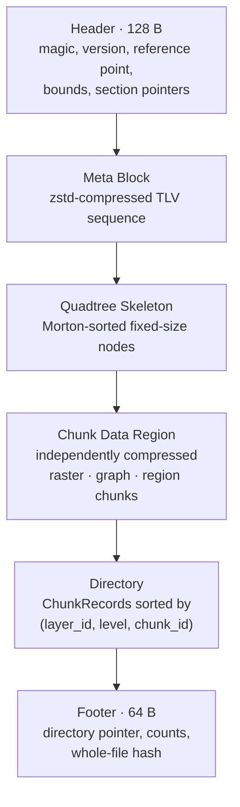

# OMF — the map container

OMF (Ourealis Map Format) is the static map container the simulator reads. One
`.omf` file holds everything the environment has to say: traversable structure,
resistance features, terrain, precomputed derived data, and the region annotations
that drive sensor events.

Three rules shape the format, and every decision below follows from them.

1. **No run-time quantities.** A weighted cost field, an attention-gated weight
   vector, a Logit choice result — none of them are stored. The map holds
   *objective environment descriptions*, so one map serves every motion mode and
   every individual.
2. **Source data is the only authority.** Slope, distance transform, roadmap and
   path library are derivable from the sources, and each derived section records a
   fingerprint of what it was derived from. A mismatch refuses the section.
3. **Unknown means skip.** An unrecognised TLV, layer or codec is skipped or
   reported as unreadable; it never fails a load. This is what makes a
   minor-version extension safe.

The file is read-only and immutable. Changes are made by rebuilding it or by
applying a patch file.

## 1. Layout



Reading order is Footer → Header → Directory → chunks on demand. The **write**
order is different — data first, then the directory, the footer, and the header
backfilled last — which is what lets the writer stream and lets sections be
appended in any order. Multi-byte integers are little-endian and floats are
IEEE 754; every section starts at an 8-byte boundary, padded with zeros.

## 2. Header (128 bytes)

| Offset | Size | Field | Notes |
|---|---|---|---|
| 0 | 4 | `magic` | `"OMF\0"` |
| 4 | 2 | `version_major` | Semantic; a reader refuses a different major. |
| 6 | 2 | `version_minor` | A newer minor is readable. |
| 8 | 4 | `flags` | Bit 0 roadmap, bit 1 zstd dictionary, bit 2 path library, bit 3 regions, bit 4 vectors, bit 31 debug data (must be 0 in a distributed file). |
| 12 | 8 | `ref_lon` | Reference longitude, radians. |
| 20 | 8 | `ref_lat` | Reference latitude, radians. |
| 28 | 4 | `epsg` | 0 means the local metre plane. |
| 32 | 16 | `bounds_x0/y0/x1/y1` | Extent in metres. |
| 48 | 2 | `base_res_cm` | Finest resolution, centimetres per cell. |
| 50 | 2 | `chunk_size` | Chunk side in cells, 256 by default. |
| 52 | 1 | `lod_count` | Pyramid levels. |
| 53 | 1 | `feature_dim` | $D$, a quick check; the authoritative schema is the feature TLV. |
| 54 | 2 | `layer_count` | Registered layers. |
| 56 | 8 | `meta_offset` | |
| 64 | 4 | `meta_len` | |
| 68 | 8 | `dir_offset` | |
| 76 | 4 | `dir_len` | |
| 80 | 8 | `footer_offset` | Must equal `file_len − 64`. |
| 88 | 8 | `ext_meta_offset` | Optional extension TLV area, 0 when absent. |
| 96 | 4 | `ext_meta_len` | |
| 100 | 4 | `header_crc32` | CRC32 over bytes `[0, 100)`. |
| 104 | 24 | `reserved` | Zero; ignored on read. |

The fields are written and read at explicit offsets rather than through a packed
struct, because the `f64` fields at offsets 12 and 20 would be unaligned in one.

The extension area pointed at by `ext_meta_offset` exists so that new
*header-level* metadata can be added without changing the header layout: new fields
go there as TLVs in the extension namespace, which keeps such an addition a
minor-version change instead of a major one.

## 3. Footer (64 bytes)

| Offset | Size | Field |
|---|---|---|
| 0 | 4 | `magic` = `"OMFF"` |
| 4 | 2 | `version_major` |
| 6 | 2 | `version_minor` |
| 8 | 4 | `flags`, mirroring the header |
| 12 | 4 | `dir_len` |
| 16 | 8 | `dir_offset` |
| 24 | 4 | `dir_record_count` |
| 28 | 4 | `chunk_count` (records minus tombstones) |
| 32 | 4 | `node_count` (skeleton nodes) |
| 36 | 4 | `layer_count` |
| 40 | 8 | `file_len` |
| 48 | 16 | `file_hash` |

The footer always occupies the last 64 bytes, so `file_hash` can be defined as the
hash of everything before it:

$$
\text{file\_hash} = \mathrm{XxHash3\text{-}128}\Big(\text{header} \,\big\|\, \mathrm{XxHash3\text{-}128}\big(\text{file}[128\ ..\ \text{file\_len} - 16]\big)\Big).
$$

The header is final only once the directory offsets are known, so it cannot take
part in a single forward streaming hash; the composition above still covers every
byte exactly once.

## 4. Meta block

A TLV sequence, compressed as one zstd frame:

```text
u32 tag ‖ u32 length ‖ u8 value[length]
```

| Tag | Name | Content |
|---|---|---|
| 0x0001 | `MAP_INFO` | Name, author, build time, upstream data hash, description. |
| 0x0002 | `LAYER_TABLE` | The layer registry: identifier, kind, channels, element type, codec, quantisation. |
| 0x0003 | `FEATURE_SCHEMA` | The $D$ resistance dimensions: name, unit, normalisation, kind. |
| 0x0004 | `WEIGHT_PRIOR` | The static weight prior per motion mode. |
| 0x0005 | `SLOPE_MODEL` | Minetti clamp, downhill coefficient default, stair speeds. |
| 0x0006 | `CONNECTOR_TABLE` | The Z-axis links. |
| 0x0007 | `ZSTD_DICT` | Optional dictionary for chunk payloads. |
| 0x0008 | `PROVENANCE` | Sources, licences, tool identification, derivation versions. |
| 0x0009 | `MAGNETIC_FIELD` | Local declination, inclination, strength. |
| 0x000A | `PRM_SEEDS` | One seed per roadmap batch. |
| 0x000B | `CHUNK_LAYOUT` | Declares the channel-continuous layout used for direct GPU upload. |
| 0x000C | `GLOBAL_STATS` | Per-channel min/max/mean, coverage, forbidden ratio, connector cost bound. |
| 0x000D | `AGGREGATION_RULES` | Per-channel coarse-aggregation operator, the proxy channel and its quantisation. |
| 0x000E | `DERIVED_LAYERS` | The fingerprint headers of the derived layers. |

Tags are namespaced by their top byte: `0x00` core, `0x01` experimental,
`0x10`–`0x7F` community, `0x80`–`0xFE` vendor, and `0xFF` temporary debug data
that must not appear in a distributed file. An unknown tag is skipped and preserved
on a rewrite, so a tool that does not understand an extension does not destroy it.

The meta block itself is compressed **without** the dictionary even when the map
carries one: the dictionary lives inside this block, so it cannot be used to
decompress its own container.

### 4.1 Global statistics and the heuristic bound

A search heuristic needs a lower bound on the cost per metre anywhere on the map,
and the file cannot store that number: cost is synthesised at run time from weights
the map does not know. `GLOBAL_STATS` therefore stores the per-channel minima, from
which a reader reconstructs

$$
\bar{c}_{\min} = \sum_i w_i\, f_{i,\min} + c_0, \qquad
\bar{c}_{\min}^{+} = \max\left(\bar{c}_{\min},\ c_{\varepsilon}\right),
$$

and, when the map carries Z-axis links, the smallest link unit cost as well. A link
is an edge like any other, and a bound that ignored it would overestimate the
remaining cost on a route over a footbridge.

The forbidden ratio in the same block is a whole-map figure: it accumulates over
every stored chunk of the hard-constraint layer, excluding the padding cells that
edge chunks carry beyond the map extent.

## 5. Spatial index

Two structures with two jobs. The **quadtree skeleton** answers *at which
granularity* an area is described and is small enough to stay resident in memory;
the **chunk directory** answers *where in the file* that description lives.

### 5.1 Skeleton nodes (16 bytes)

| Offset | Size | Field |
|---|---|---|
| 0 | 8 | `morton` |
| 8 | 1 | `flags` |
| 9 | 1 | `depth` |
| 10 | 2 | `tile_ref` |
| 12 | 2 | `aggr_mean` |
| 14 | 2 | `aggr_max` |

The key is not a bare Morton code. It carries one depth bit above the interleaved
coordinates,

$$
\text{key} = \left(1 \ll 2\,\text{depth}\right) \,\big|\, \operatorname{interleave}(x, y),
$$

because a bare code collides for the origin node at every depth. The depth follows
from the highest set bit and spatial locality is preserved, so nodes are sorted by
key: location is a binary search and the array compresses well.

Flags carry, in order, *leaf*, *has aggregate maximum*, *drill hint*, *suspected
infeasible* and *direction-constrained area*.

`aggr_mean` and `aggr_max` are the mean/max aggregation rule made physical (see
§3.2 of the [design](design.md)). A coarse cell that stored only a mean would hide an
obstacle — a block containing both grass and a wall could average out to
"passable" — so the maximum is stored alongside and a search that enters such a block
descends to the fine cells. Both are 16-bit fixed-point values of a single *proxy
channel*; the channel and its scale and bias are declared once in
`AGGREGATION_RULES`, not per node, because a node has no room for them and a reader
lacking the rule could not interpret any node.

### 5.2 Directory records (32 bytes)

| Offset | Size | Field |
|---|---|---|
| 0 | 4 | `chunk_id` (Morton code inside its layer and level) |
| 4 | 2 | `layer_id` |
| 6 | 1 | `level` |
| 7 | 1 | `codec` |
| 8 | 8 | `offset`, file-absolute |
| 16 | 4 | `comp_len` |
| 20 | 4 | `raw_len` |
| 24 | 4 | `crc32` of the stored bytes |
| 28 | 4 | `flags` |

Records are sorted by `(layer_id, level, chunk_id)` and found by binary search.
Level 0 is the finest; a level-$L$ chunk covers `chunk_size` cells of side
$2^L$ finest cells and is stored at full chunk size, edge padding included — a
reader derives a chunk's shape from the layer geometry, so a partial edge chunk
would be unreadable.

**A missing chunk is a legal state, not an error.** An open area has no fine
chunks, and recording that by the absence of a record is cheaper than a block of
zeros and says the same thing. Reading such a chunk returns `Ok(None)`.

The offset is file-absolute. A region-relative offset would have to be derived from
the section order, which changes when the extension area is present; an absolute
offset occupies the same bytes and survives appending and patching.

## 6. Layers

| Range | Class | Content |
|---|---|---|
| `0x00xx` | Terrain | Elevation (source), slope (derived), distance transform and gradient (derived). |
| `0x10xx` | Features | The resistance dimensions, one layer per channel group. |
| `0x20xx` | Constraints | Hard-forbidden bitmap, direction field, soft multipliers. |
| `0x25xx` | Regions | Polygonal sensor-event annotations. |
| `0x30xx` | Graph | Roadmap, path library, region interfaces, vector shapes. |
| `0x40xx` | Cache | Precomputed cost fields (fingerprinted). |
| `0xF0xx` | Extension | Vendor or research layers; unknown ones are skipped. |

The registered identifiers are `ELEVATION 0x0001`, `SLOPE 0x0002`, `EDT 0x0003`,
`HARD_FORBIDDEN 0x2001`, `DIRECTION 0x2002`, `SOFT_MULTIPLIER 0x2003`,
`REGIONS 0x2501`, `PRM_GRAPH 0x3001`, `KPATH_LIBRARY 0x3002`,
`REGION_INTERFACE 0x3003`, `VECTORS 0x3004` and `COST_CACHE 0x4001`.

A layer descriptor is 24 bytes: identifier (2), kind (1), channels (1), element type
(1), codec (1), `scale` (4), `bias` (4), sparse (1), reserved (9). All quantised
data is recovered with one rule,

$$
\text{real} = \text{raw}\cdot\text{scale} + \text{bias},
$$

with the parameters declared in the descriptor. Layer kinds are `Raster`, `Vector`,
`Graph`, `Bitmap` and `Region`; `Bitmap` is bit-packed with each row padded to whole
bytes, so a chunk whose width is not a multiple of eight still packs and unpacks
consistently.

Four fixed layouts appear in the graph layers:

| Structure | Size | Layout |
|---|---|---|
| `Connector` | 48 B | `type_id` u16, two endpoints of `(x, y, z)` f32, `dir_flag` u8, `v_up`, `v_down`, `wait_time` f32, `attr_ref` u32, reserved 5 B carrying `unit_cost`. |
| `RegionFeature` | 20 B | `tag_id` u16, `geom_ref` u16, `p_mp` f32, `mp_bias_m` f32, `p_loss` f32, `mp_mode` u8, 3 B padding. |
| `DerivedLayerHeader` | 32 B + 8 per seed | `source_fingerprint` u64, `build_params_hash` u64, `algo_version` u16, `seed_count` u16, `flags` u32, reserved 8 B. |
| `InterfaceLink` | in the roadmap | The roadmap node and fine cell an interface node joins, with the cost and length of the link. |

A connector carries both a cost and a speed, from the same record, so a stair
cannot be cheap and slow in one place and fast and free in another:

$$
c_e = \ell_e \cdot c_{\text{connector}} + \bar{t}_{\text{wait}} \cdot v_m,
\qquad
\ell_e = \sqrt{\Delta x^2 + \Delta y^2 + \Delta h^2},
$$

and its equivalent speed is $v_{\text{up}}$ or $v_{\text{down}}$ according to which
end is higher and which way the link is traversed.

## 7. Codecs

| Id | Name | Notes |
|---|---|---|
| `0x00` | Raw | Pass-through. |
| `0x10` | zstd | Optionally with the map's dictionary. |
| `0x11` | lz4 | Block format, fastest to decode. |
| `0x20` | Vertical delta + zstd | Row-to-row differences; the elevation default. |
| `0x21` | Channel delta + zstd | Channel 0 raw, channel $k$ minus channel 0. |
| `0x30` | Sparse | Validity bitmask plus packed valid values. |
| `0x31` | Run-length + zstd | The bitmap and category default. |
| `0x40` | Quantise + zstd | Floating-point in, integer out according to the layer descriptor. |
| `0x50` | Pyramid | zstd with the parent chunk as a raw dictionary. |

Compression is per chunk, never per file: random access is a requirement, and a
whole-file frame would force a full decompression to read one block. An unknown
codec identifier makes that one chunk unreadable — reported, so a caller can fall
back to a coarser level — and never aborts a load.

Two decoders carry a declared output size (lz4's size prefix, and the run-length and
sparse headers), and both are checked against the expected length *before*
allocating: a corrupt or hostile payload must not be able to make a reader reserve
gigabytes for a handful of bytes. The same bound applies to graph-layer payloads,
whose shape is just a byte count, and to the meta block, whose zstd frame expands
with no declared bound at all.

## 8. Aggregation rules

Different data types aggregate differently, and getting it wrong changes search
results rather than merely degrading them:

| Channel type | Allowed aggregation | Forbidden, and why |
|---|---|---|
| Scalar features | mean and maximum, both stored | Mean only: it hides impassable ground. |
| Boolean hard constraints | OR (existence) | AND or majority: one forbidden cell makes the whole block suspect. |
| Direction constraints | none — the area stays at level 0 | Vector or angle averaging: the direction field is not a linear space, and averaging two opposite directions yields "no constraint". |
| Category features | dominant class plus a mixture flag | Plain majority: a mixed block has to be flagged for descending. |

`AGGREGATION_RULES` declares the operator per channel together with the proxy
channel and its quantisation, so any reader holding the rules can interpret a
node's aggregate values with no hidden constants.

## 9. Fingerprints

Every derived layer records

$$
\text{source\_fp} = \mathrm{XxHash64}\Big(\bigoplus_{\text{source layers}} \big(\text{LayerDesc},\ \text{sorted } (\text{level}, \text{chunk\_id}, \text{crc32})\big)\Big),
$$

$$
\text{layer\_fp} = \mathrm{XxHash64}\big(\text{all source fingerprints} \,\|\, \text{build\_params} \,\|\, \text{algo\_version}\big),
$$

and the reader recomputes the source side on load. A mismatch means the sources
changed after the derived layer was built: the layer is refused and reported as
needing a rebuild, never used silently. This is what makes it safe to store
expensive caches in the file at all — a map edit invalidates them automatically, and
a patch that changes a source block invalidates exactly the layers that depend on
it.

Each derived layer's source set is declared once and must match item for item
between the builder and the reader. A layer that is *derived* but has an empty
source set is valid rather than permanently stale.

## 10. Patches

```text
base_hash    u64    hash prefix of the file the patch applies to
patch_list          replacement chunk records
new_chunks          the payloads they point at
meta_patch          optional metadata replacements
```

`base_hash` must match the base file's footer hash, or the patch is refused. Only
**source** layers may be patched: replacing a derived layer would leave it
inconsistent with its own fingerprint. After application the directory, the
extension area, the skeleton and the footer are rebuilt and the whole-file hash
recomputed.

The intended distribution pattern is *main file plus small patches*. A patch that
touches a source block changes that layer's fingerprint, so the derived layers
depending on it go stale and the preprocessing tool rebuilds exactly those. The
correctness of the chain is carried by the fingerprint mechanism rather than by the
patch tool knowing what depends on what.

## 11. Reader contract

1. **No bypass.** A derived layer is loaded only when its fingerprint verifies.
   There is no public entry point that skips the check; the maintenance escape hatch
   is hidden and warns when used.
2. **Absence is an answer.** A missing chunk means "this area has no data at this
   granularity", and the caller should use a coarser level or the graph structure.
   It is not an error.
3. **Bounds are enforced.** Section lengths, chunk shapes, allocation sizes, element
   counts and per-axis chunk counts are all checked against what the remaining bytes
   can actually contain before anything is allocated or enumerated.
4. **Caching is an implementation detail.** The reader keeps an LRU of decoded
   chunks; its size and policy are not part of the format.

## 12. Versioning

| Change | Version action | Compatibility |
|---|---|---|
| New optional TLV, layer or codec | minor | An old reader skips it; a new reader reads the old file. |
| Changed core TLV semantics or header layout | major | Not guaranteed. |

An extension may not redefine core semantics, and a reader may declare a set of
required TLVs or layers that must be present for it to load the file at all.
