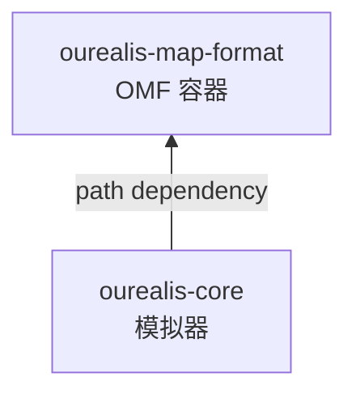
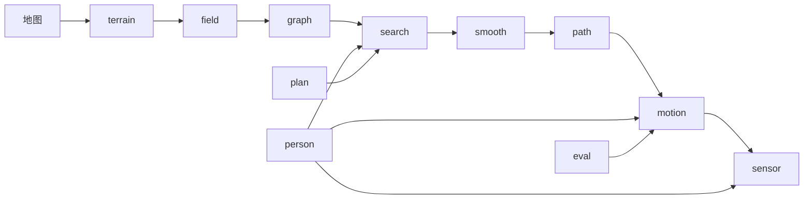

# 架构文档

## 两个 crate，一个依赖方向



`ourealis-core` 通过 `ourealis-map-format` 读地图，反向依赖不存在。因此地图工具可以只依赖格式
crate 构建而不拉入模拟器，也不会有任何格式决策被"模拟器想这么用"倒逼。

`ourealis-core` 内部是一条模块组的链，每一段只消费上一段的输出：



## `ourealis-map-format`

| 模块 | 职责 |
|---|---|
| `header`、`footer`、`bytes` | 128 字节定长文件头与 64 字节文件尾，以及显式的小端读写原语。每个字段按文档化的偏移读写，不使用 packed 结构体转换——文件头中的 `f64` 字段并非自然对齐。 |
| `tlv` | 元数据块：标签常量、各强类型载荷（`MapInfo`、`LayerTable`、`FeatureSchema`、`WeightPrior`、`SlopeModel`、`ConnectorTable`、`GlobalStats`、`AggregationRules` 等）以及读写器。未知标签在往返中保留。 |
| `quadtree`、`directory` | 双层空间索引。骨架回答某区域**用什么颗粒度**描述，目录回答该描述**在文件的哪里**。 |
| `codec` | 九种块编码器及其分发。未知编码器标识会被报告，绝不致命。 |
| `raster`、`layer` | 通道连续的块几何、打包与解包、量化，以及位图层。 |
| `graph` | 非栅格层：路标图、K 路径库、矢量形状，以及连接器表的定长布局。 |
| `region` | 带事件参数的多边形标注，以及让事件可复现的空间哈希。 |
| `fingerprint` | 源层指纹、派生层头部，以及派生算法版本登记表。 |
| `builder` | 高层写入路径：混合颗粒度分区、均值/最大值双值聚合、全局统计、自动派生。 |
| `writer`、`reader` | `MapWriter`（先写数据，再写目录、文件尾，最后回填文件头）与 `Map`（文件尾 → 文件头 → 目录，按需读块，LRU 缓存）。 |
| `patch` | 增量更新格式及其应用，含基础文件哈希校验。 |
| `synthetic` | 示例与测试使用的确定性地图生成器。 |

## `ourealis-core`

| 模块 | 职责 |
|---|---|
| `math` | `LocalFrame`（经纬度 ↔ 局部米制平面）、采样工具（插值、滑动平均、角度解缠与低通、分位数、直方图），以及零依赖的基 2 FFT（含 Hann 加窗）。 |
| `terrain` | `Grid2D` 几何、带细节层级金字塔的高程场、坡度场，以及精确欧氏距离变换与量化梯度。 |
| `field` | 成本模型：`FeatureField` 提供阻力向量视图，`CostWeights` 持有权重向量，`HardMask` 回答可通行性，`CostField` 合成逐格成本，`CostSampler` 回答任意点的成本与可通行性。 |
| `graph` | 混合搜索基底：细网格、路标点、粗格块、Z 轴连接端点与接口节点，以及"积分成本、排除硬约束与连接器足迹"的视线检查。 |
| `search` | 带膨胀启发与转弯惩罚的 Lazy Theta\*；按边惩罚生成候选；路径规模因子与 Logit 抽签。 |
| `smooth` | 带硬投影的弹性带、捷径简化、折返尖刺剔除与拐角圆化。 |
| `path` | `Path`：弧长参数化、切线/法线/曲率，以及两个逐顶点链接通道。 |
| `motion` | 速度上限、配速与疲劳及其固定点迭代、前向-后向剖面、带可行性校验的横向偏移、姿态、弹跳与低速机动。 |
| `noise` | 三层随机性：Ornstein–Uhlenbeck 过程及其精确离散解、白噪声、步频谐波与区域事件调度器。 |
| `sensor` | 真值组装与由它派生的五个传感器模型。 |
| `person` | `PersonParams` 与群体采样器。 |
| `plan` | 三种规划模式、库路径接入契约，以及保证"离开规划器的路线必定可行"的可行性回退链。 |
| `eval` | 评价指标、频谱摘要，以及带坐标搜索的标定工具。 |
| `gpu` | `ComputeBackend` trait、rayon 参考实现，以及带 WGSL 内核的 wgpu 实现。 |
| `sim` | `Simulator` 门面、批量运行器、配置树、输出类型与导出。 |

## 一次运行的数据流

1. **加载**：`MapSource::open` 得到 `Map`；`Simulator::weights` 解析权重向量——显式覆盖值，或地图
   为当前运动模式提供的权重先验，可选地再经注意力门控调制。
2. **环境**：`Environment::load_with_coarse` 读取各图层，派生地图未携带的内容（中心差分坡度、由
   硬约束位图得到的距离场），在地图没有路标图时构建一份，并向计算后端请求加权特征和。结果是
   `CostField`。
3. **图**：`MixedGraph` 在该成本场上组装四类节点。边惰性生成并缓存，一次搜索只为它展开的那条带
   付出代价。
4. **规划**：每段先用 `search::ksp::generate_candidates` 生成至多 $K$ 条候选，`search::logit`
   抽签选一条，`smooth::smooth_path_anchored` 在保持段接点固定的前提下松弛折线，最后
   `plan::clearance::first_clear_path` 用精确格点遍历校验，必要时逐级回退。
5. **盖章**：`sim::connector_lift::lift_connector_elevations` 在最终路径上写入两个逐顶点链接通道：
   路径穿过的每条 Z 轴连接的高程斜坡与速度上限。
6. **运动学**：`Trajectory::build_with_backend` 构建速度剖面、横向偏移、姿态与弹跳，再按配置的
   真值频率逐采样组装时间线。
7. **传感**：`sensor::generate` 遍历真值，每个传感器用自己的误差模型与随机流各走一遍。
8. **评价**：`MetricsReport::compute` 读取轨迹、传感器与真值；`eval::calibrate` 可以把报告变成
   标量损失。

## 计算后端

```rust
pub trait ComputeBackend: Send + Sync {
    fn name(&self) -> String;
    /// C[cell][mode] = Σ_d F[cell][d]·W[d][mode] + c0
    fn cost_field_batch(&self, f: &FeatureTensor, w: &WeightMatrix, c0: f32) -> Result<CostBatch>;
    /// N 个体 × T 采样的 O-U 漂移与白噪
    fn noise_batch(&self, spec: &NoiseBatchSpec) -> Result<NoiseBatch>;
    /// 批量可通行性与净空查询
    fn projection_check_batch(&self, request: &ProjectionBatch) -> Result<ProjectionBatchOut>;
}
```

后端边界的设计直接来自负载的形态：

* **CPU 实现是语义参考**，始终可用，也是测试覆盖的那条路径；GPU 与它对照。
* **GPU 不参与搜索**：节点扩展存在严重分支依赖，GPU 化没有收益，图搜索按设计留在 CPU。
* **噪声内核使用计数器式随机源**：顺序生成器无法在 GPU 上按同一顺序前进，因此每个采样由
  `hash(种子, 个体号, 通道号, 采样号)` 经 Box–Muller 派生。Rust 侧提供同算法的
  `counter_gaussian`，两边产生同一序列。
* **批量查询是可选项**：三个内核回答与其标量版本相同的问题，只有调用方明确要求时才走批量路径。
  对单条轨迹，内核启动与回读的开销压不过它替代的内存查询；收益属于批量场景——一份只读场与一个
  批次由多个体共享。
* **失败只降级，不中止**：适配器缺失、设备创建失败或着色器编译失败都会带告警降级到 CPU；回读
  失败作为错误上报，而不是静默返回零。

## 可复现性

一切随机量都从以 `(种子, 用途, 个体号, 通道号)` 为键的流中抽取，经混合进入 ChaCha 流，**从不
使用线程本地生成器**。由此得到两条系统依赖的性质：

* **批量运行无论跑在单线程还是整个 rayon 线程池上，结果逐位一致**——流只取决于个体号，不取决于
  哪个线程取走了它。有测试直接断言这一点。
* **仅凭 manifest 就能重放一次运行**，因此 manifest 记录了地图、模式、个体参数、种子、个体号、
  实际解析到的后端与采样率。

键的各字段逐项混合而不是按位段打包，因此不存在两个逻辑上独立的流共用同一个键。区域事件另有一种
空间确定性触发模式：触发与否与偏差方向来自哈希而非抽样（见[设计文档](design.md) §6.3）。

## 约定

* **数值**：世界几何与运动学一律 `f64`；`f32` 只出现在 OMF 存储边界与 GPU buffer 上，米制坐标在
  那里不需要更高精度。
* **成本**：两种量纲分名命名，`*_cost_per_m` 是每米路径的阻力，`*_equiv_m` 是累计的等效米——
  路径选择与搜索启发都以它标定。
* **错误**：库内一律返回 `Result`；`unwrap` 与 `panic!` 只出现在测试与示例中；畸形地图或不可用的
  起终点产生带类型的错误而不是崩溃。
* **文本**：一切运行时输出——日志、错误信息、示例打印——均为英文。
* **文档**：每个公开项都有 cargo doc 注释，写明单位、符号约定与失败条件；两个 crate 都开着
  `#![warn(missing_docs)]`。

## 模块组织

模块按职责切分而非按行数切分：一个模块长出第二种职责时新增子模块，而不是让文件变长。测试从不写在
源码树里：

* 集成测试是 `crates/*/tests/*.rs`；
* 针对私有项的单元测试是 `crates/*/tests/unit/*.rs`，由被测模块通过
  `#[cfg(test)] #[path = "..."] mod tests;` 引入，既能测私有实现，又不把测试混进源码；
* 共享夹具是 `crates/*/tests/fixtures/mod.rs`。
