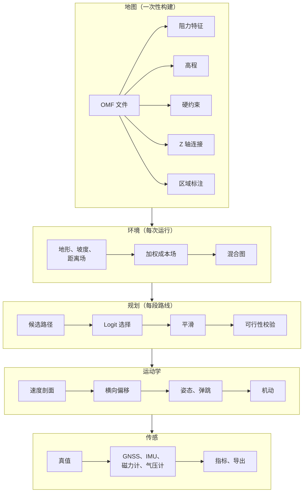
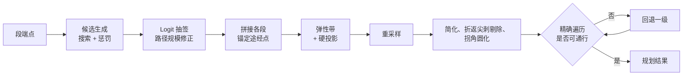

# 设计文档

本文说明 Ourealis 如何把一张地图、一个起点与一个终点变成一条轨迹和一组传感器数据流，包含每个阶段
背后的模型、实现所计算的公式，以及数据遵循的约定。

系统由五个阶段构成：

有两条分离贯穿整个设计，下文大部分决策都由它们推出。

**环境与偏好分离。** 地图存储地面是什么，跑者的权重决定它对跑者**代价多大**。流水线中没有任何
环节需要为第二种运动模式准备第二张地图。

**搜索与生成分离。** 搜索决定跑者经过哪些位置，运动学阶段决定跑多快、身体朝哪边、传感器记录到
什么。运动学约束属于第二阶段，正因如此搜索才是一个有清晰最优性结论的纯图问题。

## 1. 坐标与地形

### 1.1 局部米制平面

全部几何计算在以待定点 $(\lambda_0, \varphi_0)$ 为原点的局部切平面内进行。地理位置
$(\lambda, \varphi)$ 被转换为

$$
x = R\,(\lambda - \lambda_0)\cos\varphi_0, \qquad y = R\,(\varphi - \varphi_0),
\qquad R = 6\,371\,000\ \mathrm{m},
$$

其中经纬度差用弧度制；逆变换为

$$
\lambda = \lambda_0 + \frac{x}{R\cos\varphi_0}, \qquad \varphi = \varphi_0 + \frac{y}{R}.
$$

在园区尺度上平面近似的误差远低于传感器噪声量级。`math::LocalFrame` 保存参考点与该余弦因子，
经纬度输出由它的逆变换产生。

### 1.2 高程与坡度

`Terrain` 用双线性插值采样高程，另有细节层级金字塔服务粗查询。坡度由中心差分得到：

$$
\nabla h = \left(\frac{h(x+d,y) - h(x-d,y)}{2d},\ \frac{h(x,y+d) - h(x,y-d)}{2d}\right),
$$

$$
i = \lVert \nabla h \rVert, \qquad i_\parallel = \nabla h \cdot \hat{v}.
$$

$i$ 是地形固有坡度，恒不为负；$i_\parallel$ 是它沿运动方向 $\hat{v}$ 的分量，**上坡为正**。
同一个量在 Z 轴连接上以**坡度**的形式再次出现，此时连接器自己的高程斜坡覆盖其下方的地形
（§5.1）。

### 1.3 距离场

`terrain::edt` 用两趟 Felzenszwalb 变换计算到最近禁行格的精确欧氏距离（米），并给出量化到 16 个
罗盘方向的梯度。两个消费方需要它的不同侧面：弹性带需要**远离障碍的方向**，横向偏移校验需要
**距离**。在预处理阶段一次性量化梯度，使二者都不必对开阔区中心近乎常数的场做有限差分——那里的
差商数值病态，方向由噪声主导。

## 2. 成本场

### 2.1 阻力特征

每个网格单元携带一个 $D$ 维**阻力特征向量** $\mathbf{f} \in \mathbb{R}^D$，客观描述环境：地表
类型、交通属性、方向约束、拥挤度，以及地图在特征模式中声明的其它维度。该向量与"谁在跑"无关。

有一个维度是特殊的：方向约束以偏好方向 $\hat{d}_t$ 与强度 $\alpha_t$ 存储，它的贡献取决于运动
方向而不是仅取决于格子：

$$
f_{\text{dir}} = 1 + \alpha_t\,(1 - \cos\theta), \qquad \cos\theta = \hat{v}\cdot\hat{d}_t .
$$

顺约束方向通过不额外付出代价，完全逆向则付出 $1 + 2\alpha_t$。跑道上的偏好绕行方向与单向人行道
是同一个构造。

### 2.2 成本合成

每米成本在运行时合成：

$$
c_{\text{cell}} =
\begin{cases}
+\infty, & \text{该格硬禁行},\\[4pt]
\max\left(\mathbf{w}^\top \mathbf{f} + c_0,\ \ c_{\text{base}} \prod_{t \in T_{\text{soft}}} w_t\right), & \text{否则},
\end{cases}
$$

默认 $c_0 = 1.0$、$c_{\text{base}} = 1.0$，软约束集合为空。

这个表达式有三点是刻意设计的：

* **线性项承载偏好。** 地表、拥挤度、照明、方向偏好都是跑者会互相权衡的因素。
* **不可权衡的规则不放在这里。** 禁行区域与强制方向是布尔条件，在搜索、平滑与偏移校验中执行，
  而不是求和里的大数字。足够多的便宜地面总能"投票"压过一个数值惩罚。
* **两个分支取最大值**，因此软约束不会被过低的特征和平均掉，低乘子也无法把高特征和压下去。任一
  机制单独就足以让一个格子失去吸引力。

$+\infty$ 由哨兵值 `INFINITE_COST` $= 10^{30}$ 承担：大到足以压倒任何真实路径成本，又小到累加时
不会让 32 位浮点溢出为无穷。累计成本超过 `PRUNE_THRESHOLD` $= 10^{29}$ 的搜索节点直接剪枝。

### 2.3 权重

默认权重向量是地图为当前运动模式提供的先验：

$$
\mathbf{w} = w_{\text{scale}} \cdot \operatorname{softmax}\!\left(\frac{\mathbf{p}_m}{\tau}\right),
$$

其中 $w_{\text{scale}} = 1$（`cost_scale`）且只在成本场里乘一次。

可选的**注意力门控**用情境——时段、区域类型、个体参数——调制该先验：

$$
\mathbf{q} = W_q \mathbf{z}_{\text{ctx}}, \qquad \mathbf{k}_i = W_k \mathbf{e}_i,
\qquad \alpha_i = \operatorname{softmax}_i\!\left(\frac{\mathbf{q}^\top \mathbf{k}_i}{\sqrt{d}}\right),
$$

$$
\tilde{\alpha}_i = D\,\alpha_i, \qquad
\tilde{\alpha}_i' = \operatorname{clip}(\tilde{\alpha}_i, a_{\min}, a_{\max}), \qquad
\tilde{\alpha}_i'' = D\,\frac{\tilde{\alpha}_i'}{\sum_j \tilde{\alpha}_j'},
$$

$$
w_i = w_{\text{prior},i} \cdot \tilde{\alpha}_i'' .
$$

$d$ 是投影嵌入的宽度，$D$ 是阻力通道数，二者相互独立并分别存放在不同字段中。乘 $D$ 使平均增益为
一，截断避免某一维度被完全抑制或无限放大，第二次归一化恢复截断所破坏的均值性质。门控作用于特征
**通道**而不是序列，其矩阵由领域知识构造而不经过训练。

### 2.4 启发函数下界

搜索启发需要全图任意位置单位成本的下界，但这个数无法存储：成本是运行时合成，地图并不知道权重。
它由地图全局统计中的逐通道最小值重建：

$$
\bar{c}_{\min} = \sum_i w_i\, f_{i,\min} + c_0, \qquad
\bar{c}_{\min}^{+} = \max\left(\bar{c}_{\min},\ c_{\varepsilon}\right),
\qquad c_{\varepsilon} = 10^{-3}.
$$

正下界之所以存在，是因为当所有通道的最小值都为零时，启发会退化为零，搜索随即退化为盲目洪泛。
当地图携带 Z 轴连接时，下界还要与最小的连接器单位成本取 min：连接器与其它边一样是一条边，忽略
它的下界会在跨越天桥的路线上高估剩余成本。

### 2.5 采样

`CostSampler` 在任意点回答两个问题：是否可通行，以及一段路径的代价是多少。

可通行性由**精确的格点遍历**（Amanatides–Woo）判定，而不是沿线段采样。任何固定步长都可能漏掉
线段只切一个角的格子：抄建筑拐角的捷径，其割线短于步长，而两端都落在合法地面上。遍历恰好访问
线段进入的每一个格子，代价是每跨一次格边界一步，而不是每米一步。

线段代价是成本场沿线段的梯形积分，单位是等效米——路径选择正是以它标定的。

## 3. 混合图

### 3.1 节点类型

搜索基底在同一套标识空间里有四类节点：

| 类型 | 作用 |
|---|---|
| 细网格单元 | 结构化区域。节点**就是**它的格索引。 |
| 路标点 | 开阔区，用于表达愿望线。 |
| 粗格块 | 被认证为均匀的区域，代表其内部的所有细格。 |
| Z 轴连接端点 | 楼梯、电梯、天桥、地下通道的两端。 |

邻接在节点第一次被扩展时计算并缓存。把整张图实体化会带来与地图面积成正比的内存开销，而一次
搜索实际只展开起终点走廊附近的一条带。

### 3.2 粗格块与均值/最大值双值聚合

粗格块只有在被地图认证时才准入：是叶子、无下钻提示、无方向约束、无"疑似不可行"标记，且聚合
**最大值**低于可通行阈值。

起决定作用的是最大值。只存均值的块可能包含围墙却平均成"可通行"；同时存均值与最大值，使搜索
可以在块内均匀时直接使用它，在不均匀时下降到细格。足迹触及任何 Z 轴连接器的块直接拒绝：跨楼梯间
的平面线段本就被禁止，包住楼梯间的块会让搜索直接穿过去。

准入的块取代其内部的细格：这些格子不携带边，并被所有最近节点查询跳过。足迹先被裁剪到地图范围，
因为骨架的正方形大于非方形的地图。

### 3.3 路标点与接口节点

开阔区按 `spacing_m`（默认 15 m）带抖动撒点，保留局部成本方差低于 `openness_variance` 的点；
存活点在 `connect_radius_m`（默认 40 m）内对视线可达的点对连边。随机性是刻意的——不同的路标批次
隐含不同的愿望线，地图可以携带多批并记录各自的种子，运行时按个体选用。

路标图与细网格由**接口节点**缝合。接口节点是位于开阔区与结构化区边界上的点，同时属于两个基底：
它既连接最近的路标点，也连接它所在的细网格格。沿边界格朝向开阔地的一侧，按
`interface_spacing_m`（2 m，即细网格的构建颗粒度）输出接口点；更粗的缝法会让两个基底只在少数几处
连通，搜索不得不绕路去够到它们。

### 3.4 视线检查

`line_of_sight` 是带成本积分的判定，而不是几何判定。它依次：

1. 遍历线段进入的精确格子，遇到硬约束即拒绝；
2. 拒绝进入 Z 轴连接足迹的线段，并拒绝连接器自身的平面弦，因此跨越楼梯的路线必须使用连接边；
3. 拒绝聚合最大值超阈的粗格块；
4. 否则返回成本场沿线段的梯形积分，用于为该边定价。

## 4. 路径规划

### 4.1 搜索

搜索算法是**Lazy Theta\***，配膨胀欧氏启发：

$$
h(n) = \varepsilon \cdot d_{\text{horiz}}(n, \text{goal}) \cdot \bar{c}_{\min}^{+},
\qquad
\varepsilon = \begin{cases} 1.5, & \text{单段请求},\\ 1.2, & \text{多段请求}.\end{cases}
$$

Theta\* 只要视线可达就把节点直接连到祖父节点，因此输出任意角度的路径而不是网格 A\* 的八方向锯齿；
惰性变体把视线检查推迟到节点弹出时执行，从而省去大部分检查而不损失路径质量。跑者近似全向运动
——可以原地转身——因此本阶段不施加任何运动学约束。

单段请求使用更大的膨胀系数，来源于规划的成本结构：只有一段时搜索**就是**规划的全部开销，此时
膨胀不增加路线长度却大幅减少展开节点；有多段时后续每段都在同一张图上规划，膨胀开始让路线走形，
因此保持设计值 $\varepsilon = 1.2$。

每条边成本含**转弯惩罚**

$$
c_{\text{turn}} = \lambda_\theta (1 - \cos\Delta\theta), \qquad \lambda_\theta = 1.0\ \text{等效米},
$$

其中 $\Delta\theta$ 为相邻路径段之间的方向变化。它让搜索偏好运动学阶段跑得顺的路线——没有它，
捷径可能给出跑者必须停下来才能过的急折返。它是偏好而不是约束，且使搜索的成本函数不再是度量，
因此系统不声称返回的路线最优。

**成本口径。** 搜索报告的成本按它返回的几何重算：每一段都对成本场积分，唯一例外是 Z 轴连接
穿越所跨的段，它们按连接器自身的代价计价，即
$\ell_e \cdot c_{\text{connector}} + c_{\text{wait}}$，其中 $\ell_e$ 为三维长度。不能直接报告
搜索内部的 $g[\text{goal}]$：它含的是捷径规则后来已经消掉的拐角的转弯惩罚，而且不含首尾两段接入
段。

### 4.2 候选与 Logit 抽签

$K$ 条候选路径（默认 $K = 5$）由惩罚法生成：搜一条，把已接受路线的边乘以 $\mu = 1.6$，再搜一次。
与已有候选重复、或与某条候选共享长度超过较短路径 80 % 的候选被丢弃。在配置的惩罚步数内仍无合格
候选时，判定该段在几何上少于 $K$ 条互异路线——这是几何事实，不是错误。

候选之间的选择是带路径规模修正的 Logit 抽签：

$$
P(j) = \frac{PS_j \exp(-C_j/\beta)}{\sum_{k=1}^{K} PS_k \exp(-C_k/\beta)},
\qquad
PS_j = \sum_{e \in j} \frac{\ell_e}{L_j} \cdot \frac{1}{\sum_{k=1}^{K} \mathbb{I}(e \in k)} .
$$

$\beta$ 是个体的**理性温度**，单位等效米：慢跑、中等、竞速预设分别取 80、120 与 60。
$\beta \to 0$ 趋向确定性地选择最便宜的路线，$\beta$ 增大趋向均匀随机。这是个体间路径多样性的
主要来源，也是"一个群体走群体该走的路"的原因。路径规模因子对与其它候选共享的部分打折，因此两条
几乎相同的候选不会把同一条走廊重复计数。

有两条契约保证这一点可度量：

* **单一生成器。** 存量库与在线生成使用同一套候选生成实现与同一组参数，参数集被哈希写入存量库
  的文件头。不一致时会上报并改为在线生成——混用两个来源会让路径选择频率分布在"命中库"与"未命中
  库"的两次运行之间失去可比性。
* **末端接入。** 存量候选的起终点按粗粒起终点键索引，可能与查询点相距数十米。只有当它的**精确**
  首尾端点都落在 $d_{\text{attach}} = 30\ \mathrm{m}$ 以内时才使用存量路线，否则整条在线生成。
  门限内，两段接入段在 $2\,d_{\text{attach}}$ 的局部窗口内搜索，拼接后的折线重新计价与重新测长，
  因为随库体存储的数字描述的是库体，而不是接入后的路线。

### 4.3 平滑

选中的折线按**弹性带**松弛。对每个内部顶点 $\xi_i$：

$$
\xi_i \leftarrow \xi_i + \beta_s\left(\tfrac{1}{2}(\xi_{i-1} + \xi_{i+1}) - \xi_i\right)
+ \eta\,\nabla d(\xi_i)\,\phi\!\left(d(\xi_i)\right),
$$

其中 $\beta_s = 0.35$、$\eta = 0.6$，门控函数为

$$
\phi(d) = \operatorname{clamp}\!\left(\frac{r_{\text{safe}} - d}{r_{\text{safe}}}, 0, 1\right),
\qquad r_{\text{safe}} = 0.75\ \mathrm{m}.
$$

避障项使用距离场的**正**梯度——指向远离最近障碍的方向——并只在安全半径内生效。使用负梯度会把
弹性带推向障碍。

迭代在最大位移小于 0.02 m 或达到 30 次时停止。每次迭代后弹性带被投影回可行地面：落入禁行格的
顶点拉回最近可行格中心，距离小于 $r_{\text{safe}}$ 的顶点沿梯度推离，与硬约束相交的线段插入中点
（并对总点数设上限，否则一道厚墙会让点数每轮翻倍）。真正保证结果合法的是投影，而不是这两项力。

**锚点。** 路线两端固定，调用方请求的每一个途经点也固定。这比看上去更重要：收缩项把顶点拉向两端
之间的直线弦，而在搜索返回的折线上——顶点间距可达数十米——它会在迭代预算内把途经点的绕行整段
拉平。途经点与两端点一样，属于调用方明确提出的要求。随后的捷径简化按锚点分段进行，因为简化保留
所给序列的首末顶点，否则它会切掉锚点所代表的那次拐弯。

**曲率与拐角圆化。** 曲率由重采样折线的三个相邻采样估计，且刻意不做低通。三点估计在重采样折线的
顶点处会高估曲率，而低通会抬高弯道的速度上限，横向加速度校验却仍看原始曲率；两者随即分歧，偏移
每隔一个采样被拉进来一次，产生的急动度远超跑者所能产生。低通想解决的问题属于几何本身，因此改为
圆化拐角：`round_corners` 把每个转角超过约 10° 的顶点替换为一段半径为
$\min(R_{\text{corner}}, L_{\text{straight}})$ 的圆弧，采样使每个插入顶点的转角不超过 5°。每个
插入点都校验可通行性，无法圆化的拐角保持原样。

**折返尖刺。** 长度在一米以内的"出去又回来"会被删除，前提是绕过它的捷径可通行。运动学阶段沿
弧长单调推进，尖刺会让跑者位置反向而弧长继续增长，加速度计会把它读成不可能产生的力。

### 4.4 可行性回退链

搜索之后有多道工序会改动几何，而每一道只能用自己的局部或采样模型检验自己的输出。硬约束不可
协商，因此最终折线要用精确格点遍历校验；失败时逐级回退，直到有一级可通行。搜索原始输出是最后的
依靠，而它本来就是可通行的——搜索用同一个遍历测试为它的每一条边定价。只有全部层级失败才报错，
这使"规划器返回了路线"与"路线可通行"成为同一句话。

## 5. 运动学

### 5.1 速度上限

每个剖面采样点的速度上限是四项的最小值：

$$
v_{\lim}(\ell) = \min\Big(\underbrace{v_{\text{slope}}(\ell)}_{\text{生理}},\
\underbrace{\sqrt{a_{\text{lat,max}} / \lvert\kappa(\ell)\rvert}}_{\text{转弯}},\
\underbrace{v_{\text{fatigue}}(t)}_{\text{疲劳}},\
\underbrace{v_{\text{down,cap}}(\ell)}_{\text{制动}}\Big).
$$

**坡度。** 跑步的生理代价采用 Minetti 能量模型，单位是每公斤体重每米**水平**距离的焦耳数：

$$
C(i) = 155.4\,i^5 - 30.4\,i^4 - 43.3\,i^3 + 46.3\,i^2 + 19.5\,i + 3.6
\qquad [\mathrm{J\,kg^{-1}\,m^{-1}}],
$$

其中**输入**被截断到 $\lvert i \rvert \le 0.25$：超出该范围多项式不再物理，陡下坡会给出负成本。
截断输入而不是输出，是从不出现负的速度上限的原因。维持恒定能量消耗率给出沿路径速度：

$$
v_{\text{slope}} = v_{\text{target}} \cdot \frac{C(0)}{C(i_{\text{ahead}})} \cdot \sqrt{1 + i_{\text{ahead}}^2},
$$

根号因子把水平速度换算为沿弧长速度；缓坡上它接近 1，保留它是为了在陡坡上量纲一致。

$i_{\text{ahead}}$ 是 15–30 m 前瞻窗口内的坡度，因为跑者反应的是前方而不是脚下。默认聚合方式为
距离加权平均；另一种模式在窗口内出现超过 0.05 的上坡时取最不利值，用来模拟跑者看得见的坡会保守
应对。

**转弯。** 侧向加速度受 $a_{\text{lat,max}}$ 约束，按预设取 1.5 至 3.5 m/s²：

$$
v \le \sqrt{\frac{a_{\text{lat,max}}}{\lvert\kappa\rvert}} .
$$

该预算低于骑行者，因为跑步腾空相没有侧向支撑。这是全系统中唯一约束跑步侧向加速度的地方；搜索
阶段不施加它，正因如此搜索才是一个纯图问题。

**疲劳。** 距离受临界速度模型约束：

$$
v_{\text{fatigue}}(t) = v_{\text{crit}} + (v_0 - v_{\text{crit}})\,e^{-t/\tau_f},
\qquad v_0 = v_{\text{target}}, \quad v_{\text{crit}} = \rho\, v_{\text{target}},
$$

其中 $\rho$ 在 0.65 至 0.85 之间，$\tau_f$ 在 600 至 1500 s 之间。它作为**上限**参与合成：可以
压住疲惫的跑者，不会强制要求某个速度。

**下坡制动。** 恒定能量率假设会给出**更快**的下坡速度，而制动、落地冲击与步频不允许：

$$
v_{\text{down,cap}} = k_{\text{down}} \cdot v_{\text{target}} \quad (i_{\text{ahead}} < 0),
\qquad k_{\text{down}} \in [1.10,\ 1.20].
$$

**Z 轴连接。** 连接用它记录中声明的等效速度覆盖以上四项（楼梯默认上楼 0.5 m/s、下楼 0.7 m/s）。
台阶不是连续坡度，生理模型不描述它；没有这一覆盖，跑者会以旁边平地的速度冲进楼梯间。连接器的
坡度同样取自它自己的高程斜坡而不是其下方的地形，因此俯仰与气压计跟随楼梯，而坡度上限不会与它
打架。

### 5.2 配速与时间耦合

意图配速服从归一化策略

$$
g_{\text{even}}(\tau) = 1, \qquad
g_{\text{pos}}(\tau) = 1 + a\,(1 - 2\tau), \qquad
g_{\text{neg}}(\tau) = 1 + a\,(2\tau - 1),
$$

$$
v_{\text{target}}(t) = \bar{v}\, g(t/T), \qquad \bar{v} = L/T, \qquad a = 0.06,
$$

其中 $\tau = t/T$ 为归一化时间。三者在整段行程上均值都为一，因此策略重新分配用力而不改变平均
配速。

疲劳与配速依赖已用时间，已用时间依赖速度剖面，剖面又依赖疲劳与配速。该依赖由带阻尼的固定点迭代
解决：

$$
T^{(0)} = \frac{L}{\bar{v}}, \qquad t^{(0)}(\ell) = T^{(0)} \frac{\ell}{L},
$$

$$
v_{\lim}^{(k)}(\ell) = f\big(\ell,\ t^{(k)}(\ell),\ T^{(k)}\big)
\;\longrightarrow\; \text{前向-后向扫描} \;\longrightarrow\; t_{\text{raw}}^{(k+1)}(\ell),
$$

$$
T^{(k+1)} = T^{(k)} + \omega\left(t_{\text{raw}}^{(k+1)}(L) - T^{(k)}\right), \qquad \omega = 0.5 .
$$

时间映射按阻尼后的总时间重新缩放。迭代在 $\lvert \Delta T \rvert < 0.5$ s 或三轮后停止。若
$\lvert \Delta T \rvert$ 持续增大或超过 60 s，判定为发散：配速策略回退为匀速，疲劳按 $T^{(0)}$
只求值一次，并给出告警。回退保证了运动学可行的剖面总能产生——一次运行可以损失配速保真度，但
绝不会失去时钟与速度之间的一致性。

在**上一轮的时间映射**上求值依赖时间的项，而不是按弧长比例估计，使疲劳跟踪真正产生的配速分布；
这也使强正分割成为最难的情形，阻尼正是为稳定它而存在。

### 5.3 前向-后向剖面

加速度可行性由两趟扫描施加：

$$
\text{前向:}\quad v_{i+1} = \min\!\left(v_{\lim,i+1},\ \sqrt{v_i^2 + 2\,a_{\max}\,\Delta\ell}\right),
$$

$$
\text{后向:}\quad v_i = \min\!\left(v_{\lim,i},\ \sqrt{v_{i+1}^2 + 2\,a_{\max}\,\Delta\ell}\right).
$$

两趟都用加号；后向趟只是把同一递推从末端评估一遍，这正是"提前开始减速"的机制。用减号会允许跑者
刹不下来的速度。

**边界条件。** 普通行程起于静止、终于静止：终点 $v_{\lim}(L) = 0$ 生成冲线前的自然减速。单圈闭环
改用周期边界，做法是用首末速度的平均值反复传播直至二者一致，从而让闭环在接缝处自洽。

**驻足点**——`dwell` 途经点与在折返处登记的零时长停止点——只在距其弧长最近的那一个剖面采样上
强制。若把整段间距宽的窗口都置零，两趟扫描会把两米当作处处限速为零，跑者只能爬过去。落在同一个
剖面采样上的多个驻足点会被合并、时长相加，因此折返处的 `dwell` 不会丢掉两次驻足中的一次。

**采样与插值。** 剖面每 0.25 m 采样一次，读取时使用 Catmull–Rom 插值，并在两个端点采样之间做
单调限幅，避免样条过冲到扫描不允许的速度。零速点附近，插值以解析斜坡

$$
v(\ell) \ge \sqrt{2\,a_{\max}\,\lvert \ell - \ell_{\text{zero}} \rvert}
$$

为下界——这正是扫描自身满足的关系。没有它，谷底处样条导数为零，跑者每次停下后都要爬行约一米。

**时间线。** 轨迹按

$$
\Delta\ell = v\,\Delta t + \tfrac{1}{2}\,a\,\Delta t^2, \qquad a = v\,\frac{dv}{d\ell},
$$

推进弧长，并夹到剩余路径长度与下一个驻足点。加速度取剖面自身隐含的值而不是个体的加速度预算：
恒为正的距离项会让位置推进比报告速度更快——巡航时微不足道，临近停车时成为主项。夹到下一个驻足点
使到点精确；夹到终点避免冲线后再补一个虚假的制动采样。另设采样预算，防止推进停滞时循环不退出。

### 5.4 横向偏移与有效曲率

跑者不会压在中线上。偏移 $d$ 是一个 Ornstein–Uhlenbeck 过程，默认均值 $+0.6$ m（正方向为跑者
左侧）、稳态标准差 0.35 m、时间常数 45 s。

它沿**机体**法线施加，而不是路径法线：

$$
\mathbf{p}(t) = \xi(t) + d(t)\,\hat{n}_{\text{body}}(t).
$$

两者的区别只在折返处显现，而那里是决定性的：路径切线在一个采样内翻转，而身体还在转，因此按路径
法线放置的偏移会瞬间横跨中线两倍偏移量。机体法线在那里是连续的。

三条校验约束偏移。

**有效曲率。** 曲线侧向平移会按平行曲线关系改变其曲率

$$
\kappa_{\text{eff}}(t) = \frac{\kappa(t)}{1 - d(t)\,\kappa(t)},
\qquad \lvert 1 - d\kappa \rvert \ge 0.3,
$$

同时侧向加速度必须满足
$v^2\,\lvert\kappa_{\text{eff}}\rvert \le a_{\text{lat,max}}$。在弯道内侧，跑者比中线转得更急；
越界时按比例收缩偏移，这也正是跑者的行为——没有人会在急弯内侧压着外线跑。

**环境。** 平移后的点必须落在可通行地面上，且与障碍的距离不小于 $r_{\text{safe}}$；否则沿距离
梯度收缩偏移直到满足，或收缩到零。

**有界动力学。** 请求的偏移先做 0.5 s 低通，其二阶差分再受个体侧向加速度预算约束。
Ornstein–Uhlenbeck 过程连续但不可导，其原始抽样进入加速度计就是跑者不可能产生的力。

施加值在限值**收紧时立即跟随**——安全没有理由等待——在限值重新放开时按
$\text{transition}_m / v$ 的时间常数斜坡恢复，因此解禁不会产生横向台阶。由于限值在剖面的 0.25 m
采样上求解而轨迹按真值频率放置，最后一遍在轨迹自身采样率上重新求局部上限，并以 0.1 m/m 的斜率
限制做前向-后向扫描：与速度剖面同一套思路，只是作用于偏移。上限在障碍之前开始收缩，之后恢复。

由此得到一条一致性规则：**下游所有曲率消费方都使用 $\kappa_{\text{eff}}$**——横滚、陀螺仪的偏航
角速度、转弯率指标。中线曲率只保留在速度上限中。若下游使用中线曲率，惯性数据会在每个弯道与对外
报告的轨迹不一致，偏移较大处可达数十个百分点。

### 5.5 姿态

姿态按 ZYX 分解——先偏航，再俯仰，后横滚：

$$
R_q = R_z(\psi)\,R_y(\theta_{\text{pitch}})\,R_x(\phi_{\text{roll}}).
$$

**躯干航向**是偏移后轨迹的切线角，解缠后用 0.35 s 时间常数低通。低通不是装饰：原始切线在每个
折线顶点都会跳变，这些跳变会在陀螺仪上表现为每个顶点一个脉冲。

**头部航向**是前瞻 0.6–1.5 s（个体参数）处的躯干航向再做低通。它让头戴设备呈现"先转头、后转体"
的真实模式，且从不进入 $R_q$：旋转矩阵描述躯干，也就是安装设备的那个刚体。

**俯仰**是地形项加上与速度成比例的前倾：

$$
\theta_{\text{pitch}} = \arctan(i_\parallel)
+ \theta_{\text{lean,max}} \cdot \operatorname{clamp}\!\left(\frac{v}{v_{\text{target}}}, 0, 1.5\right),
\qquad \theta_{\text{lean,max}} \in [1°, 5°].
$$

前倾是加速度计水平轴直流分量的来源。没有它数据会"过于干净"，而"几乎竖直的慢跑者"与"明显前倾的
竞速者"之间的差别，正是下游分类器会使用的真实信号。

**横滚**是向心内倾：

$$
\phi_{\text{roll}} = \operatorname{clip}\!\left(\arctan\!\left(\frac{v^2 \kappa_{\text{eff}}}{g}\right), -10°, +10°\right),
\qquad g = 9.81\ \mathrm{m/s^2},
$$

并经 0.5 s 低通。符号由矩阵决定：正横滚是绕机体前向轴的右手旋转，把躯干压向右侧，因此跑者
**左转时取负角**才是向内倾。其截断比骑行者紧得多，因为跑步腾空相没有侧向支撑。

姿态负责放置对外报告的位置，且只做一遍放置，并在所有顶点切线按实际经过的位置重算之后进行，因此
传感器与轨迹对"身体朝哪边"不可能有分歧。

切线估计本身的窗口是步幅的一部分；当它跨过静立或折返时必须改成单侧估计，因为跨越两个方向的窗口
没有有意义的差值。取哪一侧取决于机动位于哪一侧：折返在跑者**身后**时方向取自前方，在**前方**时
取自后方。取反会让身体继续面朝来路，而位置骑在机体法线上，姿态于是会再转一遍那个弯。

### 5.6 弹跳与步态签名

每一步产生一次竖直振荡，它属于真值而不是传感器：

$$
z_{\text{bounce}}(t) = A_b(v)\; g_{\text{bounce}}\!\left(2\pi f_{\text{step}} t + \phi_0\right),
$$

$$
A_b(v) = A_{b,0} \cdot \operatorname{clamp}\!\left(\frac{v}{v_{\text{target}}}, 0, 1.5\right),
\qquad
g_{\text{bounce}}(u) = \frac{\sin u + \beta_2 \sin(2u + \pi/2)}{1 + \beta_2}.
$$

波形是不对称的——触地下沉比蹬伸慢——其中 $\beta_2 = 0.049$。它刻意**不做**峰值归一化：$A_b$ 是
其**基波**的幅值，这使加速度计的基波恰为 $A_b (2\pi f_{\text{step}})^2$，也就使下游的高度估计
能够从加速度还原弹跳。

真值高度是地形加上弹跳，

$$
z(t) = h\big(x(t), y(t)\big) + z_{\text{bounce}}(t),
$$

它同时供给三个消费方：对外报告的竖直坐标、气压计、以及竖直比力。

加速度计的步频成分是步频各阶谐波之和，

$$
a_{z,\text{osc}}(t) = \sum_k A_k \sin\!\left(2\pi k f_{\text{step}} t + k\phi_0 + \phi_k'\right),
$$

其基波**锁定**于弹跳——$A_1 = A_b(v)\,(2\pi f_{\text{step}})^2$、相位 $\phi_0$——更高阶则由录音
标定：$A_2/A_1 = 0$、$A_3/A_1 = 0.107$。

二次谐波取零，来自谐波在求导下的行为。位移的 $k$ 阶谐波出现在加速度上时被放大 $k^2$ 倍，因此
波形自身的不对称已经产生了加速度的二次谐波：$4 \times 0.049 = 0.195$，正是实测值。再叠加一项
配置的二次谐波就是把同一个物理效应计两次，会把模拟器推到实测比值的数倍。

一个自带相位的弹跳加上一个自带相位的加速度谐波，会让任何"由加速度积分恢复高度"的算法失效。
共享 $\phi_0$ 并让基波取自真值自身的二阶导，正是为了让它不可能发生。

### 5.7 机动

有三种行为无法由连续速度剖面表达，由系统显式生成。

**起步静立。** 跑者先等待 12 s 乘以 $[0.5, 1.5]$ 的个体抽样，站在带偏移的起跑位置上，然后按
$a_{\max}$ 加速。这段时间的 GNSS 漂移云团与其它时段来自同一个 Ornstein–Uhlenbeck 过程——真实
录音开头的"起点云团"就是它。

**到站静立。** 零速边界生成减速，之后附一段静立。

**原地转身。** 路线折返处，跑者减速至停，以梯形角速度旋转——以 $\alpha = 8\ \mathrm{rad/s^2}$
加速到 1.7–3.5 rad/s 的峰值再减速——然后加速离开，总转角由所需角度反解。

折返有两处细节值得说明：

* **转轴放在检测窗口内方向变化最剧烈处**，做法是以十分之一米的步长遍历该窗口。转轴是跑者真正
  转身的**位置**，窗口只是说明折返发生在它内部的某处。若在扫描位置而非折返点转身，跑者会面朝
  反方向走完剩下的路，而偏移骑在机体法线上，仅此一项就足以在本该静止时产生每秒一米的横向扫动。
* **判定阈值取 150°。** 120° 的弯道是跑者倾身通过的弯；把它当作折返，会在弯道密集的路线上产生
  大量"停-转-起"循环。

**驻足。** `dwell` 途经点就是带时长的驻足点：剖面在最近采样处置零速，时间线在那里保持位置，真值
因此真正静止——驻留期间的 GNSS 漂移云团与气压计的安静正是由它派生。

### 5.8 闭环与改道

**闭环。** 闭合路线通过在参考点处拆分规划：$p_0 \to p_m \to p_0$，把两半拼接并精确闭合。多圈是
把路径首尾相接成一条路径，而不是在时间线层面循环，因此速度剖面、偏移过程、配速漂移与弹跳相位
都在接缝处连续演化，无需任何特殊处理。单圈采用周期速度边界；多圈行程起止均为静止，如同比赛。

**改道。** 运行中到达的打卡点触发从跑者当前状态重新规划：新路段从当前位置起步，并以当前速度作为
其剖面的起始速度，因此重建的路段不会先刹停再加速；它自身的折返与其它路段一样登记为驻足点。旧、
新轨迹在切换窗口内按 smoothstep 权重混合，

$$
\mathbf{p}_{\text{blend}}(t) = \big(1 - \alpha(t)\big)\,\mathbf{p}_{\text{old}}(t)
+ \alpha(t)\,\mathbf{p}_{\text{new}}(t),
\qquad
\alpha = 3\tau^2 - 2\tau^3, \quad \tau = \frac{t - t_{\text{now}}}{\Delta},
$$

该权重的导数在两端为零，因此切换处的位置与速度都连续——跑者像是在改变主意，而不是被剪接。

## 6. 随机性

### 6.1 三层

随机性按作用对象分离。三层的时间尺度与职责不同，混用它们——典型症状是噪声的**颜色**不对——正是
自相关指标用来发现的问题。

| 层 | 机制 | 时间尺度 |
|---|---|---|
| 决策层 | Logit 温度 $\beta$ | 每段一次抽签 |
| 运动层 | Ornstein–Uhlenbeck 漂移（配速、偏移）、步频谐波、高频抖动 | 秒到分钟，另有逐步 |
| 传感器层 | 各设备零偏（Ornstein–Uhlenbeck）、白噪声、区域事件 | 逐设备 |

### 6.2 漂移模型

所有缓慢漂移的量共用同一个过程：

$$
d\delta = -\theta\,\delta\,dt + \sigma_c\,dW_t,
\qquad
\operatorname{Var}(\delta_{\text{ss}}) = \frac{\sigma_c^2}{2\theta}.
$$

实现只暴露稳态标准差 $\sigma_s$，调用方永远不必处理扩散系数，并且用**精确离散解**：

$$
\delta' = \mu + (\delta - \mu)\,e^{-\theta \Delta t}
+ \sigma_s \sqrt{1 - e^{-2\theta \Delta t}}\; \mathcal{N}(0,1).
$$

精确形式很重要。一阶近似 $\sigma_s\sqrt{2\theta\Delta t}$ 只在 $\theta \Delta t \ll 1$ 时保持
$\sigma_s$ 的稳态含义；用在更长的时间步上会让实际方差无界增长，直接与参数声明相矛盾。采用精确
形式后，$\sigma_s$ 在任意步长下都是稳态标准差，且 CPU 实现、偏移阶段与 GPU 内核产生同一序列。

### 6.3 随机流与事件模式

一切随机量都从以 `(种子, 用途, 个体号, 通道号)` 为键的流中抽取，经混合进入 ChaCha 流。系统其余
部分依赖由此得到的两条性质：

* **并行不可见。** 批量运行无论跑在单线程还是整个 rayon 线程池上结果逐位一致，因为随机流只取决于
  个体号，不取决于哪个线程取走了它。
* **一次运行可由 manifest 重放**，其中记录了地图、模式、个体参数、种子、个体号、实际解析到的后端
  与采样率。

键的各字段逐项混合而不是按位段打包，因此不存在两个逻辑上独立的流共用同一个键。

区域事件另有一种触发模式。在**空间确定性**模式下，触发与否与偏差方向来自
`(种子, 区域, 进入序号)` 的哈希而不是抽样，因此同一个体每次运行得到完全相同的事件序列。回归测试
与参数标定需要它：若使用独立抽样，相同输入的两次运行会产生不同的传感器数据，优化器会把事件随机性
当成目标函数的一部分去追。

高频位置抖动只加到对外报告的位置上，绝不加到加速度计所依据的加速度上：3–5 cm 的白噪位置在
100 Hz 下做两次差分就是数 m/s² 的、跑者从未产生过的力。两个位置作为独立字段携带，而不是靠约定
区分。

配速漂移是作用在意图配速上的乘性因子（$\sigma = 5\%$、$\tau = 60$ s），按剖面时间表中的**真实
时间**步进。按剖面采样序号步进会把它的时间常数绑到采样间距上。

## 7. 传感器

### 7.1 真值

一切都由惯性频率下的每采样一份 `TruthState` 派生：低频质心位置及其导数、含抖动的对外位置、相对
地形的高度、姿态、有效曲率、坡度，以及静立与转身标记。传感器模型只看这一个结构，看不到地图也看
不到规划结果——这正是数据流之间不可能互相矛盾的原因。

高程与坡度在路径带链接通道处取自路径，其余取自地形，因此走在天桥上的跑者，气压计读到桥面高度，
俯仰用的是桥面坡度。

### 7.2 GNSS

$$
\mathbf{p}_{\text{gps}}(t) = \mathbf{p}(t) + \mathbf{b}_{\text{OU}}(t)
+ \boldsymbol{\epsilon}_{\text{white}}(t) + \boldsymbol{\eta}_{\text{multipath}}(t),
$$

零偏 $\sigma = 5$ m、$\tau = 120$ s，白噪声每轴 3 m，另有区域触发的 5–20 m 多径突发，持续 10–60 s，
带升余弦包络。两项噪声的垂直分量都放大一倍，因为接收机的高度几何远差于水平几何。

速度不是带噪位置的差分。对整段带噪位置差分会把噪声的模长当成速度——静止接收机读出每秒数米——
把多径偏差变成同量级的尖峰，并让估计系统性偏大。实现对慢漂移差分并投影到运动方向，得到有符号、
无偏的相关分量，高频段由接收机自身的白噪声提供；多径只进入位置，因为静态偏差不出现在多普勒速度
中。这样下游滤波器就能看到它们预期的位置-速度相关性：同一个慢误差以正确的符号与量级同时出现在
两者中。

丢帧是位置的性质而不是多径模型的性质：隧道会无条件丢弃所有定位。零偏过程按真实流逝时间步进，
因此一段丢帧既不会把它们冻住，也不会让恢复时用一步差分跨过整个间隙。

### 7.3 加速度计

$$
\mathbf{a}_{\text{imu}} = R_q^\top\left(\ddot{\mathbf{p}} - \mathbf{g}\right)
+ \mathbf{b}_a + \boldsymbol{\epsilon}_a + a_{z,\text{osc}}\,\hat{e}_z',
\qquad
\mathbf{g} = (0, 0, -9.81)\ \mathrm{m/s^2}.
$$

加速度计测量的是**比力**，因此静止设备在竖直轴上读 $+9.81$。所用的加速度来自低频质心，由非均匀
二阶差分得到——内部用中央式、两端用单侧式——匀速运动时处处为零。零偏是 Ornstein–Uhlenbeck 过程
（$\sigma = 0.02$ m/s²），白噪声 0.03 m/s²，步频成分沿机体竖直轴作用，其 $\phi_0$ 与 $A_1$ 由
弹跳锁定。

### 7.4 陀螺仪

机体角速度取自姿态欧拉角的变化率，因此陀螺仪与加速度计对"身体朝哪边转"不可能有分歧。稳态下偏航
角速度等于 $v\,\kappa_{\text{eff}}$；原地转身时它是机动的梯形剖面，而姿态本来就跟着它走，因此
传感器侧不需要任何特判。

一个步频振荡骑在偏航轴上，并以 30 % 的幅值加在横滚轴上以表达摆臂相对躯干的反相，相位与弹跳共享
基准。其幅值（0.5 rad/s）是个体参数而不是常量，因为它必须可关闭：校验转向率关系的测试要把其它
分量固定住。零偏（$\sigma = 0.002$ rad/s）与白噪（$\sigma = 0.005$ rad/s）补全模型。

### 7.5 磁力计

$$
\mathbf{m}_{\text{imu}} = R_q^\top\left(\mathbf{B}_{\text{earth}} + \mathbf{B}_{\text{dist}}\right)
+ \mathbf{b}_m + \boldsymbol{\epsilon}_m .
$$

$\mathbf{B}_{\text{earth}}$ 由地图的磁场参数（强度、磁偏角、磁倾角）构造，$\mathbf{b}_m$ 是缓慢
变化的硬/软铁偏差，$\mathbf{B}_{\text{dist}}$ 是区域触发的偶极子脉冲，有它自己的时长分布
（1–10 s）。复用多径突发的 10–60 s 会让每次扰动长出数倍：路过的车辆与反射的卫星信号是两种不同
现象，即使同一个区域同时触发两者。

### 7.6 气压计

$$
P = P_0 \exp\!\left(-\frac{z(t)}{8434\ \mathrm{m}}\right) + \epsilon_P,
$$

$z(t)$ 是含弹跳的真值高度。消费级气压计能分辨几帕，对应几厘米高度——恰好是步频纹波的量级。没有
这层纹波的气压计数据在频域上一眼可辨，这正是弹跳属于真值而不只属于加速度计的原因。天气尺度的
漂移由一个极慢的 Ornstein–Uhlenbeck 过程加入，Z 轴连接上的爬升通过它的高程斜坡体现。

## 8. 评价与标定

### 8.1 评价指标

`MetricsReport` 收集"一次运行像不像人"的那些量，每一个都是有合理区间的数值，而不是针对代码的
通过/失败断言。

| 指标 | 定义 | 说明什么 |
|---|---|---|
| 路径比 | $L_{\text{path}} / d_{\text{euclid}}$ | 路线既没有到处抄近道，也没有异常绕远。 |
| 速度分布 | 运动段的分位数与直方图 | 配速；可用两样本 Kolmogorov–Smirnov 统计量与参考分布比较。 |
| 转弯率分布 | $v\,\kappa_{\text{eff}}$ 的直方图 | 转弯是否物理；定义在有效曲率上，因此它就是轨迹自身的转向。 |
| 残差自相关 | 速度与位置残差的自相关 | 运动噪声的**颜色**；去趋势窗与滞后范围以秒固定。 |
| GNSS 误差 | 水平分位数、垂直散布、速度误差、丢帧率 | 误差预算是否与配置的设备相符。 |
| 频谱 | 加速度计与气压计的步频峰与谐波比 | 步态签名，以及两个通道描述的是同一次步态。 |
| 弹跳一致性 | 实测基波与按配速缩放的预测值之比 | 弹跳与加速度计共享幅值与相位。 |
| 圈时一致性 | $\mathrm{CV} = \operatorname{std}(T_r)/\operatorname{mean}(T_r)$ | 真实跑者约 1–4 %：更大说明噪声漏进时钟，更小说明噪声没有真正作用于运动学。 |
| 路径几何质量 | $\operatorname{mean}\lvert\kappa_{\text{eff}}\rvert$ | 路线是否病态；正常校园路线在 $10^{-3}$–$10^{-2}$ 量级。 |

速度统计只取运动段——速度不低于 0.5 m/s 且既非静立也非转身。起停斜坡是过渡过程，混入会把低
分位数拉到步行速度，与真实跑步数据的比较随即失去意义。

### 8.2 标定

同一批量也是参数标定的目标。每个 target 是一个值与一个容差，损失为

$$
\mathcal{L}(\theta) = \sum_{i} \left(\frac{o_i(\theta) - o_i^{\star}}{\sigma_i}\right)^2,
$$

即**按容差**而非按相对误差衡量的偏差平方和。一个差五倍的比值与一个差 8 % 的步频不该放在同一把
尺子上比较：前者已知得很松，后者已知得很准，而相对误差损失会完全忽视后者。

优化器是对少量具名旋钮的坐标搜索——步频、弹跳幅值与不对称度、谐波比、目标配速——每个都带物理
上下界，且直接作用于个体参数。它无梯度、确定性，适合这种量少且弱耦合的参数集，也让标定过程可
复现。标定必须运行在区域事件的确定性模式下，否则优化器会把事件随机性当成目标函数的一部分去追。
