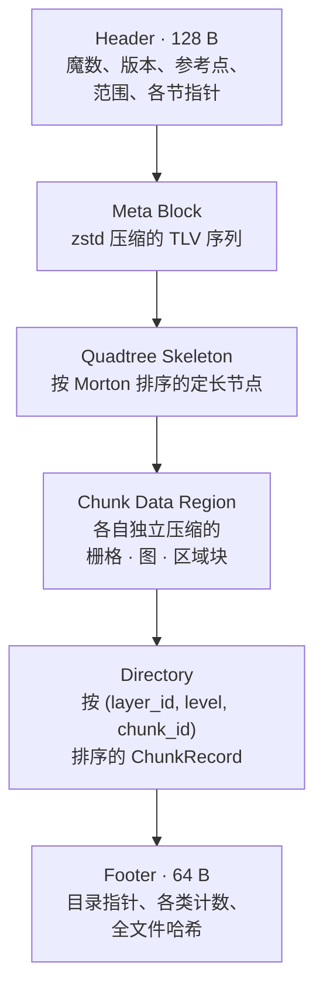

# OMF —— 地图容器

OMF（Ourealis Map Format）是模拟器读取的静态地图容器。单个 `.omf` 文件承载环境要说的一切：可通行
结构、阻力特征、地形、预计算的派生数据，以及驱动传感器事件的区域标注。

三条规则塑造了这个格式，下文每个决策都由它们推出。

1. **不存储运行时量。** 加权成本场、注意力调制后的权重、Logit 选择结果都不入文件。文件里只有
   **客观环境描述**，因此同一张地图服务任意运动模式与任意个体。
2. **源数据是唯一事实来源。** 坡度、距离场、路标图、路径库都可由源数据派生，每个派生节都记录它
   所依赖的源的指纹。指纹失配即拒绝加载该节。
3. **未知即跳过。** 未识别的 TLV、图层或编码器会被跳过或报告为"不可读"，绝不导致加载失败。这是
   次版本扩展安全的前提。

文件是只读且不可变的。内容变更通过重建文件或应用补丁完成。

## 1. 总体布局



读取顺序是 Footer → Header → Directory → 按需读块。**写入顺序不同**：先写数据，再写目录与文件尾，
最后回填文件头——这才使写入可以流式进行、各节可以任意顺序追加。多字节整数一律小端，浮点为
IEEE 754；每节起始位置按 8 字节对齐，用 0 填充。

## 2. 文件头（128 字节）

| 偏移 | 长度 | 字段 | 说明 |
|---|---|---|---|
| 0 | 4 | `magic` | `"OMF\0"` |
| 4 | 2 | `version_major` | 语义化主版本；主版本不同即拒绝加载。 |
| 6 | 2 | `version_minor` | 次版本更高可读。 |
| 8 | 4 | `flags` | bit0 含路标图，bit1 含 zstd 字典，bit2 含路径库，bit3 含区域层，bit4 含矢量层，bit31 调试数据（分发文件必须为 0）。 |
| 12 | 8 | `ref_lon` | 参考点经度，弧度。 |
| 20 | 8 | `ref_lat` | 参考点纬度，弧度。 |
| 28 | 4 | `epsg` | 0 表示局部米制平面。 |
| 32 | 16 | `bounds_x0/y0/x1/y1` | 范围，米。 |
| 48 | 2 | `base_res_cm` | 最细分辨率，厘米/格。 |
| 50 | 2 | `chunk_size` | 块边长（格），默认 256。 |
| 52 | 1 | `lod_count` | 金字塔层数。 |
| 53 | 1 | `feature_dim` | $D$，仅作快速校验；权威定义在特征 TLV。 |
| 54 | 2 | `layer_count` | 注册图层数。 |
| 56 | 8 | `meta_offset` | |
| 64 | 4 | `meta_len` | |
| 68 | 8 | `dir_offset` | |
| 76 | 4 | `dir_len` | |
| 80 | 8 | `footer_offset` | 必须等于 `file_len − 64`。 |
| 88 | 8 | `ext_meta_offset` | 可选扩展 TLV 区，0 表示无。 |
| 96 | 4 | `ext_meta_len` | |
| 100 | 4 | `header_crc32` | 覆盖字节 `[0, 100)`。 |
| 104 | 24 | `reserved` | 全零，读取时忽略。 |

字段按显式偏移读写，而不是通过 packed 结构体——其中的 `f64` 字段位于偏移 12 与 20 处，在 packed
结构体里会非对齐。

`ext_meta_offset` 指向的扩展区存在的意义是：新增**头级**元数据可以走扩展区 TLV，而不必改动文件头
布局，从而把这类演进保持在次版本范围内，不必触发主版本递增。

## 3. 文件尾（64 字节）

| 偏移 | 长度 | 字段 |
|---|---|---|
| 0 | 4 | `magic` = `"OMFF"` |
| 4 | 2 | `version_major` |
| 6 | 2 | `version_minor` |
| 8 | 4 | `flags`，与文件头同义 |
| 12 | 4 | `dir_len` |
| 16 | 8 | `dir_offset` |
| 24 | 4 | `dir_record_count` |
| 28 | 4 | `chunk_count`（记录数减去墓碑） |
| 32 | 4 | `node_count`（骨架节点数） |
| 36 | 4 | `layer_count` |
| 40 | 8 | `file_len` |
| 48 | 16 | `file_hash` |

文件尾永远占据最后 64 字节，因此 `file_hash` 可以定义为它之前全部内容的哈希：

$$
\text{file\_hash} = \mathrm{XxHash3\text{-}128}\Big(\text{header} \,\big\|\, \mathrm{XxHash3\text{-}128}\big(\text{file}[128\ ..\ \text{file\_len} - 16]\big)\Big).
$$

文件头要等目录偏移定稿后才能最终确定，无法参与一次前向流式哈希；上面的复合定义同样让每个字节恰好
被覆盖一次。

## 4. 元数据块

一个 TLV 序列，整体压缩为一帧 zstd：

```text
u32 tag ‖ u32 length ‖ u8 value[length]
```

| Tag | 名称 | 内容 |
|---|---|---|
| 0x0001 | `MAP_INFO` | 地图名、作者、构建时间、上游数据哈希、描述。 |
| 0x0002 | `LAYER_TABLE` | 图层注册表：标识、类别、通道数、数据类型、编码器、量化参数。 |
| 0x0003 | `FEATURE_SCHEMA` | $D$ 个阻力维度的名称、单位、归一化、取值类型。 |
| 0x0004 | `WEIGHT_PRIOR` | 各运动模式的静态权重先验。 |
| 0x0005 | `SLOPE_MODEL` | Minetti 截断阈值、下坡系数默认值、楼梯等效速度。 |
| 0x0006 | `CONNECTOR_TABLE` | Z 轴连接列表。 |
| 0x0007 | `ZSTD_DICT` | 块载荷的可选字典。 |
| 0x0008 | `PROVENANCE` | 数据来源、许可、工具标识、派生算法版本。 |
| 0x0009 | `MAGNETIC_FIELD` | 本地磁偏角、磁倾角、强度。 |
| 0x000A | `PRM_SEEDS` | 每批路标图的随机种子。 |
| 0x000B | `CHUNK_LAYOUT` | 声明通道连续布局，用于 GPU 直接加载。 |
| 0x000C | `GLOBAL_STATS` | 逐通道 min/max/mean、覆盖率、禁行占比、连接器成本下界。 |
| 0x000D | `AGGREGATION_RULES` | 逐通道的粗层聚合算子、代理通道及其量化参数。 |
| 0x000E | `DERIVED_LAYERS` | 各派生层的指纹头部。 |

标签按高 8 位划分命名空间：`0x00` 核心、`0x01` 实验、`0x10`–`0x7F` 社区、`0x80`–`0xFE` 厂商、
`0xFF` 临时调试（不得出现在分发文件中）。未知标签会被跳过，并在重写时原样保留，因此不认识某个
扩展的工具不会把它销毁。

元数据块本身**不使用字典压缩**，即使地图携带了字典：字典就存放在这个块里，它无法用来解压自己的
容器。

### 4.1 全局统计与启发下界

搜索启发需要全图任意位置单位成本的下界，而文件无法存这个数：成本由运行时按文件并不知道的权重合成。
因此 `GLOBAL_STATS` 存储逐通道最小值，读取方据此重建

$$
\bar{c}_{\min} = \sum_i w_i\, f_{i,\min} + c_0, \qquad
\bar{c}_{\min}^{+} = \max\left(\bar{c}_{\min},\ c_{\varepsilon}\right),
$$

并在存在 Z 轴连接时再与最小的连接器单位成本取 min。连接器与其它边一样是一条边；忽略它的下界会在
跨越天桥的路线上高估剩余成本。

同一块中的禁行占比是全图量：对硬约束层的每个已存块累加，并排除边缘块超出地图范围的填充格。

## 5. 空间索引

两个结构、两种职责。**四叉树骨架**回答某区域**用什么颗粒度**描述，小到足以常驻内存；**块目录**
回答该描述**在文件的哪里**。

### 5.1 骨架节点（16 字节）

| 偏移 | 长度 | 字段 |
|---|---|---|
| 0 | 8 | `morton` |
| 8 | 1 | `flags` |
| 9 | 1 | `depth` |
| 10 | 2 | `tile_ref` |
| 12 | 2 | `aggr_mean` |
| 14 | 2 | `aggr_max` |

键不是裸 Morton 码，它在交错坐标之上保留一位深度位，

$$
\text{key} = \left(1 \ll 2\,\text{depth}\right) \,\big|\, \operatorname{interleave}(x, y),
$$

因为裸码在原点的所有深度上都相同。深度由最高置位推出，空间局部性保持不变，于是节点按键升序排列：
定位是二分查找，数组也便于压缩。

flags 依次表示**叶子**、**有聚合最大值**、**下钻提示**、**疑似不可行**与**方向约束区**。

`aggr_mean` 与 `aggr_max` 是均值/最大值双值聚合规则的物理落地（见[设计文档](design.md) §3.2）。
只存均值的粗格会隐藏障碍——一块既有草地又有围墙的格子可能平均成"可通行"——因此最大值同时存储，
搜索进入这类块时下降到细格。两者是单一**代理通道**的 16 位定点量化值；代理通道与其 scale、bias
只在 `AGGREGATION_RULES` 中声明一次，而不由节点自身携带：节点没有空间放它们，缺少该规则的读取方
也根本无法解释任何一个节点。

### 5.2 目录记录（32 字节）

| 偏移 | 长度 | 字段 |
|---|---|---|
| 0 | 4 | `chunk_id`（其图层与层级内的 Morton 码） |
| 4 | 2 | `layer_id` |
| 6 | 1 | `level` |
| 8 | 8 | `offset`，文件绝对偏移 |
| 16 | 4 | `comp_len` |
| 20 | 4 | `raw_len` |
| 24 | 4 | `crc32`，覆盖存储态字节 |
| 28 | 4 | `flags` |

记录按 `(layer_id, level, chunk_id)` 排序，用二分查找。level 0 最细；第 $L$ 层的一块覆盖边长
$2^L$ 个最细格的方块，且**按完整块尺寸存储，边缘块的填充一并存储**——读取方从图层几何推导块的
形状，半截的边缘块会读不出来。

**缺失块是合法状态，不是错误。** 开阔区没有细块，用"没有记录"表达比写一块全零更省空间、语义也
一样明确。读取缺失块返回 `Ok(None)`。

偏移是文件绝对偏移。相对某节的偏移需要从各节顺序推导该节起点，而扩展区是否存在会改变顺序；绝对
偏移占用相同的字节数，且让追加与打补丁更直接。

## 6. 图层

| 区段 | 类别 | 内容 |
|---|---|---|
| `0x00xx` | 地形 | 高程（源）、坡度（派生）、距离与梯度（派生）。 |
| `0x10xx` | 特征 | 各阻力维度，一层承载一组通道。 |
| `0x20xx` | 约束 | 硬禁行位图、方向约束场、软约束乘子。 |
| `0x25xx` | 区域 | 多边形传感器事件标注。 |
| `0x30xx` | 图结构 | 路标图、路径库、区域接口、矢量形状。 |
| `0x40xx` | 缓存 | 预计算成本场（带指纹）。 |
| `0xF0xx` | 扩展 | 厂商或研究图层，未知即跳过。 |

已注册的标识：`ELEVATION 0x0001`、`SLOPE 0x0002`、`EDT 0x0003`、`HARD_FORBIDDEN 0x2001`、
`DIRECTION 0x2002`、`SOFT_MULTIPLIER 0x2003`、`REGIONS 0x2501`、`PRM_GRAPH 0x3001`、
`KPATH_LIBRARY 0x3002`、`REGION_INTERFACE 0x3003`、`VECTORS 0x3004`、`COST_CACHE 0x4001`。

图层描述项 24 字节：标识(2)、类别(1)、通道数(1)、数据类型(1)、编码器(1)、`scale`(4)、`bias`(4)、
sparse(1)、保留(9)。所有量化数据都按同一条规则还原，

$$
\text{real} = \text{raw}\cdot\text{scale} + \text{bias},
$$

参数在描述项中声明。图层类别有 `Raster`、`Vector`、`Graph`、`Bitmap` 与 `Region`；`Bitmap` 按位
打包，且每行补齐到整字节，因此宽度不是 8 的倍数的块也能一致地打包与解包。

图结构层中有四种定长布局：

| 结构 | 大小 | 布局 |
|---|---|---|
| `Connector` | 48 B | `type_id` u16，两端点各 `(x, y, z)` f32，`dir_flag` u8，`v_up`、`v_down`、`wait_time` f32，`attr_ref` u32，保留 5 B 承载 `unit_cost`。 |
| `RegionFeature` | 20 B | `tag_id` u16、`geom_ref` u16、`p_mp` f32、`mp_bias_m` f32、`p_loss` f32、`mp_mode` u8、3 B 填充。 |
| `DerivedLayerHeader` | 32 B + 每种子 8 B | `source_fingerprint` u64、`build_params_hash` u64、`algo_version` u16、`seed_count` u16、`flags` u32、保留 8 B。 |
| `InterfaceLink` | 见路标图 | 接口节点所缝合的路标点与细网格格，以及该链接的成本与长度。 |

连接器同时携带成本与速度，且来自同一条记录，因此不会出现"某条楼梯在一处又便宜又慢、在另一处又快
又免费"：

$$
c_e = \ell_e \cdot c_{\text{connector}} + \bar{t}_{\text{wait}} \cdot v_m,
\qquad
\ell_e = \sqrt{\Delta x^2 + \Delta y^2 + \Delta h^2},
$$

其等效速度按哪一端更高、沿哪个方向通行取 $v_{\text{up}}$ 或 $v_{\text{down}}$。

## 7. 编码器

| Id | 名称 | 说明 |
|---|---|---|
| `0x00` | Raw | 直通。 |
| `0x10` | zstd | 可选使用地图字典。 |
| `0x11` | lz4 | 块格式，解压最快。 |
| `0x20` | 垂直差分 + zstd | 行间差分；高程默认。 |
| `0x21` | 通道间差分 + zstd | 通道 0 原样，通道 $k$ 减去通道 0。 |
| `0x30` | 稀疏 | 有效性位掩码加打包后的有效值。 |
| `0x31` | 游程 + zstd | 位图与类别通道默认。 |
| `0x40` | 量化 + zstd | 浮点输入，按图层描述项输出整型。 |
| `0x50` | 金字塔 | 以父块作原始字典的 zstd。 |

压缩以块为单位，而不是整文件：随机访问是硬需求，整文件帧会迫使读一个块就解压全图。未识别的编码器
标识只让该块不可读——会被报告，调用方可回退到更粗的层级——但绝不会中断加载。

有两种解码器自带输出长度（lz4 的尺寸前缀，以及游程与稀疏的自带头部），二者都在分配**之前**与期望
长度比对：损坏或敌意的载荷不得让读取方为几个字节保留数 GB 内存。同一边界也适用于图结构层的载荷
（它们的"形状"就是字节数）与元数据块（其 zstd 帧完全没有声明上界）。

## 8. 聚合规则

不同数据类型有各自的聚合方式，搞错会改变搜索结果，而不只是降低精度：

| 通道类型 | 允许的聚合 | 禁止的，以及原因 |
|---|---|---|
| 标量特征 | 均值与最大值双存 | 只存均值：会掩盖不可通行区域。 |
| 布尔硬约束 | OR（存在性） | AND 或多数表决：一格禁行，整块都必须存疑。 |
| 方向约束 | 不聚合，该区域保持 level 0 | 向量或角度平均：方向场不是线性空间，两个相反方向平均会得出"无约束"。 |
| 类别特征 | 支配类加混合度标记 | 简单多数：混合块必须被标记为需要下钻。 |

`AGGREGATION_RULES` 逐通道声明算子，同时声明代理通道及其量化参数，因此任何持有该规则的读取方都
能解释节点的聚合值，不含隐含常量。

## 9. 指纹

每个派生层记录

$$
\text{source\_fp} = \mathrm{XxHash64}\Big(\bigoplus_{\text{源层}} \big(\text{LayerDesc},\ \text{升序 } (\text{level}, \text{chunk\_id}, \text{crc32})\big)\Big),
$$

$$
\text{layer\_fp} = \mathrm{XxHash64}\big(\text{全部源层指纹} \,\|\, \text{build\_params} \,\|\, \text{algo\_version}\big),
$$

读取方在加载时重算源侧。失配意味着派生层构建之后源数据发生了改变：该层被拒绝并报告"需重建"，
绝不静默使用。这正是把昂贵缓存安全地存进文件的前提——地图一改，它们自动失效；补丁改了某个源块，
恰好依赖它的那些层失效。

每个派生层的源层集合只在一处声明，且构建器与读取器必须逐项一致。一个"被标记为派生但源集合为空"
的层应判为有效而不是永远失效。

## 10. 补丁

```text
base_hash    u64    补丁适用的基础文件哈希前缀
patch_list          替换用的块记录
new_chunks          它们指向的载荷
meta_patch          可选的元数据替换
```

`base_hash` 必须与基础文件文件尾的哈希一致，否则拒绝。只有**源层**可以被补丁修改：替换派生层会让
它与自己的指纹不一致。应用之后会重建目录、扩展区、骨架与文件尾，并重算全文件哈希。

预期的分发形态是"主文件 + 小补丁"。补丁改动一个源块会改变该层的指纹，依赖它的派生层因此失效，
预处理工具只需重建这些层。链条的正确性由指纹机制承担，而不需要补丁工具自己知道谁依赖谁。

## 11. 读取接口契约

1. **不得绕过。** 派生层只在指纹校验通过时加载。不存在跳过校验的公开入口；维护用的逃生门是隐藏
   的，且调用时会产生告警。
2. **缺失是答案。** 缺失块表示"该区域在这个颗粒度上没有数据"，调用方应改用更粗层级或图结构，
   而不是把它当成错误。
3. **边界一律校验。** 各节长度、块形状、分配尺寸、元素个数与每轴块数，都要先用剩余字节数判断是否
   可能容纳，然后才分配或枚举。
4. **缓存属于实现细节。** 读取器持有解码块的 LRU，其容量与策略不属于格式语义。

## 12. 版本策略

| 变更 | 版本动作 | 兼容性 |
|---|---|---|
| 新增可选 TLV、图层或编码器 | 次版本递增 | 旧读取方跳过；新读取方可读旧文件。 |
| 修改核心 TLV 语义或文件头布局 | 主版本递增 | 不保证兼容。 |

扩展项不得重定义核心语义；读取方可以声明一组"必需 TLV/图层"，缺一即整体拒绝加载。
